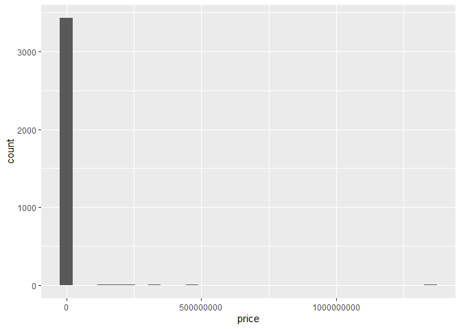
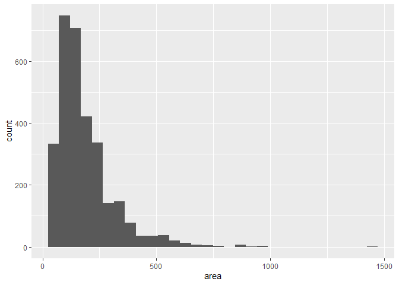
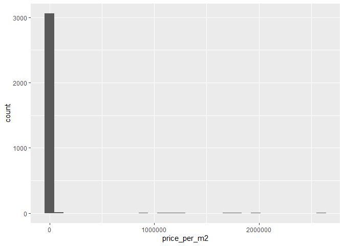
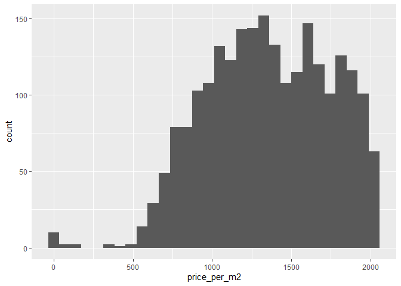
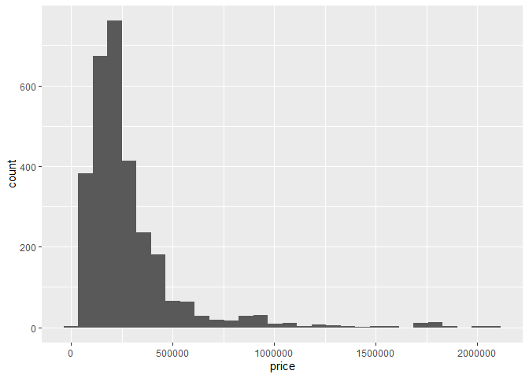

## Introduction

For this analysis, we will examine the effect that area (measured in squared meters) has on the value of an apartment, for residential use, in Santo Domingo, Dominican Republic. Prices and apartment's characteristics are collect via web scraping ([here](https://github.com/augustojimenez/residential_webscraping) you can see how it was done). Specifically, data were retrieved on 2nd of August, 2022, from supercasas.com, a beacon on the online Dominican real estate market.

In this article, I will guide you, step by step, on how I performed the data cleaning process and explain the reasons any particular step was chosen. Without further ado, let's begin.

## Loading libraries and data

First, I loaded the libraries used throughout the cleaning process, set the seed (so, results are reproducible), and cleared the objects from the work space. Finally, I loaded the data retrieved from supercasas.com on different dates.


```r
rm(list = ls())

options(scipen = 999)

library(robustbase)
library(tidyverse)
library(caret)

set.seed(1234)

path <- "../../0_Data Collection/1_data/0_raw/housing price/"
housing_files <- list.files(path)
housing <- read_csv(paste0(path, housing_files))
```

The data cleaning process involves seeing and slightly analyzing the data. As I will also perform the Exploratory Data Analysis and some statistical modelling in a later stage, I must not see and clean the whole dataset. Doing so might bias results.

I am interested in the data retrieved on 2nd of August, 2022 for residential apartments listed in Santo Domingo. Here I filtered the dataset to match this criteria. Then, we split the dataset into training (70%) and testing (30%). I'll only analyze the training set to clean it. The same steps are applied onto the testing set.


```r
housing <- housing %>%
  filter(date ==  "2022-08-02",
         usage == "Residencial",
         province %in% c("Santo Domingo", "Santo Domingo Centro (D.N.)")) %>%
  rename(location = neighborhood) %>%
  select(-c(date, usage, city, province))

inTrain <- createDataPartition(housing$price.usd, p = 0.7, list = FALSE)

training <- housing[inTrain, ]
testing <- housing[-inTrain, ]
```

On the 2nd of August, 2022, there were 5,980 apartments for residential use listed in supercasas.com that were located in Santo Domingo. For creating the data cleaning process, I'll use a randomly selected subset of 4,188 apartments with the same overall characteristics.


```r
dim(housing)
```

```
## [1] 5980   21
```

```r
dim(training)
```

```
## [1] 4188   21
```

```r
dim(testing)
```

```
## [1] 1792   21
```

## Data cleaning

First, let's take a look at the dataset:


```r
glimpse(training)
```

```
## Rows: 4,188
## Columns: 21
## $ id        <chr> "/apartamentos-venta-piantini/1286053/", "/apartamentos-vent…
## $ parking   <dbl> 1, 4, NA, 2, 2, NA, NA, 2, 2, 2, 2, 2, 2, 2, 2, 3, 2, 2, 3, …
## $ bathrooms <dbl> 2.0, 4.5, NA, 2.0, 2.0, NA, 3.5, 3.5, 2.0, 3.5, 2.0, 2.5, 2.…
## $ bedrooms  <dbl> 1, 4, 3, 3, 3, NA, 3, 3, 3, 3, 3, 2, 3, 3, 3, 3, 3, 2, 3, 2,…
## $ currency  <chr> "US$", "US$", "US$", "US$", "US$", "US$", "US$", "US$", "RD$…
## $ price     <dbl> 227000, 340000, 440000, 200000, 200000, 190000, 300000, 2700…
## $ seller    <chr> "KW Capital", "Innova By Bello Jaquez", "Premium Real Estate…
## $ location  <chr> "Piantini", "Piantini", "Piantini", "Piantini", "Piantini", …
## $ status    <chr> "Nueva", "Segundo Uso", "En Construcción", "Segundo Uso", "S…
## $ area      <dbl> 76, 336, NA, 180, 180, NA, 280, 230, 176, 190, 155, 123, 153…
## $ story     <dbl> 3, 5, NA, 3, 3, NA, NA, 2, 4, 5, 3, NA, 3, NA, 9, 8, 2, NA, …
## $ planta    <lgl> TRUE, TRUE, TRUE, FALSE, FALSE, FALSE, FALSE, TRUE, FALSE, T…
## $ lift      <lgl> TRUE, TRUE, TRUE, FALSE, FALSE, FALSE, FALSE, TRUE, FALSE, T…
## $ pool      <lgl> TRUE, FALSE, FALSE, FALSE, FALSE, FALSE, FALSE, FALSE, FALSE…
## $ pozo      <lgl> TRUE, FALSE, TRUE, FALSE, FALSE, TRUE, FALSE, FALSE, FALSE, …
## $ terraza   <lgl> TRUE, FALSE, TRUE, FALSE, FALSE, FALSE, FALSE, FALSE, FALSE,…
## $ lobby     <lgl> TRUE, TRUE, TRUE, FALSE, FALSE, TRUE, FALSE, TRUE, FALSE, TR…
## $ balcon    <lgl> TRUE, FALSE, TRUE, FALSE, FALSE, TRUE, FALSE, FALSE, FALSE, …
## $ jacuzzi   <lgl> TRUE, FALSE, TRUE, FALSE, FALSE, FALSE, FALSE, FALSE, FALSE,…
## $ gimnasio  <lgl> TRUE, FALSE, TRUE, FALSE, FALSE, TRUE, FALSE, FALSE, FALSE, …
## $ price.usd <dbl> 227000.0, 340000.0, 440000.0, 200000.0, 200000.0, 190000.0, …
```

Our training dataset contains 4,188 observations and 21 variables. Of them, we can highlight `price`, `currency` and `price.usd`. Where `price` and `currency` is the actual price shown in the listing's site. Any apartment can be listed in local currency or US dollars, depending on the seller's preference. I created `price.usd` on the data collection step to show prices on the same currency: US dollars. Hence, if prices were stated in local currency, they were converted into US dollars. Otherwise, they stayed the same. I'll drop `currency` and `price`, and keep `price.usd`. Then, and for simplicity's sake, I'll rename `price.usd` as simply `price`.


```r
training <- training %>%
  select(-c(currency, price)) %>%
  rename(price = price.usd)

testing <- testing %>%
  select(-c(currency, price)) %>%
  rename(price = price.usd)
```

## Missing values

When looking at the proportion of `NA`s are present per variable, over 50% of listings did not provide information regarding the floor the apartment is located at. And so, I removed that variable. The proportion of missing values for all other variables is acceptable.


```r
apply(training, 2, 
      \(x) {
        n <- length(x)
        na <- x %>%
          is.na() %>%
          sum()
        prop.na <- na / n * 100
        })
```

```
##         id    parking  bathrooms   bedrooms     seller   location     status 
##  0.0000000  6.8529131  4.4890162  2.4116523  0.0000000  0.5730659  4.7755492 
##       area      story     planta       lift       pool       pozo    terraza 
## 10.7927412 52.4832856  0.0000000  0.0000000  0.0000000  0.0000000  0.0000000 
##      lobby     balcon    jacuzzi   gimnasio      price 
##  0.0000000  0.0000000  0.0000000  0.0000000  0.0000000
```

```r
training <- training %>%
  select(-c(story))

testing <- testing %>%
  select(-c(story))
```

## First look at outliers

Before implementing some formal procedure for removing outliers, let's analyse the data at hand. First, we can see that `area` has some outstanding observations: a minimum value of 30 and a maximum of 650,000 squared meters.


```r
summary(training)
```

```
##       id               parking       bathrooms        bedrooms    
##  Length:4188        Min.   :1.00   Min.   :1.000   Min.   :1.000  
##  Class :character   1st Qu.:1.00   1st Qu.:2.000   1st Qu.:2.000  
##  Mode  :character   Median :2.00   Median :2.500   Median :3.000  
##                     Mean   :1.99   Mean   :2.694   Mean   :2.534  
##                     3rd Qu.:2.00   3rd Qu.:3.500   3rd Qu.:3.000  
##                     Max.   :7.00   Max.   :7.500   Max.   :8.000  
##                     NA's   :287    NA's   :188     NA's   :101    
##     seller            location            status               area         
##  Length:4188        Length:4188        Length:4188        Min.   :    30.0  
##  Class :character   Class :character   Class :character   1st Qu.:    97.0  
##  Mode  :character   Mode  :character   Mode  :character   Median :   149.0  
##                                                           Mean   :   470.7  
##                                                           3rd Qu.:   222.0  
##                                                           Max.   :650000.0  
##                                                           NA's   :452       
##    planta           lift            pool            pozo        
##  Mode :logical   Mode :logical   Mode :logical   Mode :logical  
##  FALSE:1682      FALSE:1368      FALSE:2808      FALSE:3247     
##  TRUE :2506      TRUE :2820      TRUE :1380      TRUE :941      
##                                                                 
##                                                                 
##                                                                 
##                                                                 
##   terraza          lobby           balcon         jacuzzi       
##  Mode :logical   Mode :logical   Mode :logical   Mode :logical  
##  FALSE:2483      FALSE:1833      FALSE:1372      FALSE:3516     
##  TRUE :1705      TRUE :2355      TRUE :2816      TRUE :672      
##                                                                 
##                                                                 
##                                                                 
##                                                                 
##   gimnasio           price           
##  Mode :logical   Min.   :        65  
##  FALSE:2057      1st Qu.:    142975  
##  TRUE :2131      Median :    220000  
##                  Mean   :   1263377  
##                  3rd Qu.:    320000  
##                  Max.   :1350000000  
## 
```

By viewing the "largest apartments", two things became apparent:

1.  First, there are repeated observations on this small sample: see the third and fourth rows, for instance.

2.  Second, the first four rows are obviously typos: the seller typed 650,000 instead of 650 squared meters, to cited the first case.

When analyzing the "smallest apartments", everything seems in order.


```r
training %>%
  arrange(desc(area)) %>%
  head(10)
```

```
## # A tibble: 10 × 18
##    id      parking bathrooms bedrooms seller location status   area planta lift 
##    <chr>     <dbl>     <dbl>    <dbl> <chr>  <chr>    <chr>   <dbl> <lgl>  <lgl>
##  1 /apart…       5       3.5        3 Flavi… Piantini Segun… 650000 TRUE   TRUE 
##  2 /apart…       2       3.5        3 Premi… Alma Ro… En Co… 220000 TRUE   TRUE 
##  3 /apart…       2       3.5        3 Premi… Alma Ro… En Co… 220000 TRUE   TRUE 
##  4 /apart…      NA       5.5        5 Vícto… Cuesta … Segun…   1431 TRUE   FALSE
##  5 /apart…       5       4.5        4 Paez … La Espe… Segun…    964 TRUE   TRUE 
##  6 /apart…       5       4.5        4 Anyel… La Espe… Fidei…    963 FALSE  FALSE
##  7 /apart…       5       5.5        5 Top S… Serrall… Segun…    918 TRUE   TRUE 
##  8 /apart…       4       6          4 Paez … La Espe… Segun…    890 FALSE  FALSE
##  9 /apart…      NA      NA          4 Paez … Anacaona <NA>      890 FALSE  FALSE
## 10 /apart…       4       4.5        4 Hogar… Anacaona Segun…    873 TRUE   TRUE 
## # … with 8 more variables: pool <lgl>, pozo <lgl>, terraza <lgl>, lobby <lgl>,
## #   balcon <lgl>, jacuzzi <lgl>, gimnasio <lgl>, price <dbl>
```

So, to fix (1) I eliminated duplicates. To solve (2), I divided by 1,000 the area of those apartments with over 10,000 squared meters of area. Finally, as for (3), I removed those apartments that are obviously not of interest.


```r
training <- training %>%
  mutate(area = ifelse(area > 10000, area / 1000, area)) %>%
  unique()

testing <- testing %>%
  mutate(area = ifelse(area > 10000, area / 1000, area)) %>%
  unique()
```

Let's do the same with `price`. But viewing `price` or `area` alone might be misleading as an apartment with 30 squared meters could be worth 20,000 dollars, but one with 280 squared meters could hardly be worth \$10,256. What I mean is, price must be analyse in regards with area. Price per squared meter could tell us more about how extreme of a value it is.


```r
summary(training$price)
```

```
##       Min.    1st Qu.     Median       Mean    3rd Qu.       Max. 
##         65     150000     226300    1265877     330000 1350000000
```

```r
ggplot(training, aes(price)) +
  geom_histogram()
```

```
## `stat_bin()` using `bins = 30`. Pick better value with `binwidth`.
```

<!-- -->


```r
summary(training$area)
```

```
##    Min. 1st Qu.  Median    Mean 3rd Qu.    Max.    NA's 
##    30.0   100.0   151.0   183.7   225.0  1431.0     364
```

```r
ggplot(training, aes(area)) +
  geom_histogram()
```

```
## `stat_bin()` using `bins = 30`. Pick better value with `binwidth`.
```

```
## Warning: Removed 364 rows containing non-finite values (stat_bin).
```

<!-- -->

## Some feature engineering

When analysed individually, `price` and `area` show some pretty hardcore outliers. What about price in relation to area, that's price per squared meter, or area in relation to the number of bedrooms? Let's do some feature engineering to create measures for these relations:


```r
training <- training %>%
  mutate(price_per_m2 = price / area,
         area_per_br = area / bedrooms)

testing <- testing %>%
  mutate(price_per_m2 = price / area,
         area_per_br = area / bedrooms)
```

Well, I still got similar results ...


```r
summary(training$price_per_m2)
```

```
##      Min.   1st Qu.    Median      Mean   3rd Qu.      Max.      NA's 
##       0.7    1166.7    1576.9    5833.6    2027.0 2596153.8       364
```

```r
summary(training$area_per_br)
```

```
##    Min. 1st Qu.  Median    Mean 3rd Qu.    Max.    NA's 
##   20.33   51.00   65.00   70.62   81.00  381.50     390
```

```r
ggplot(training, aes(price_per_m2)) +
  geom_histogram()
```

```
## `stat_bin()` using `bins = 30`. Pick better value with `binwidth`.
```

```
## Warning: Removed 364 rows containing non-finite values (stat_bin).
```

<!-- -->

It's still rather blurry... I cannot see a clear pattern in the data distribution. Let's filter data below the third quartile, based on price per squared meter.


```r
training %>%
  filter(price_per_m2 < 2027) %>%
  ggplot(aes(price_per_m2)) +
  geom_histogram()
```

```
## `stat_bin()` using `bins = 30`. Pick better value with `binwidth`.
```

<!-- -->

Now I can see something interesting. It seems that `price_per_m2` shows a right skewed distribution. Also, there are some weird values such a 70 cents per squared meter. That seems too low of a price, right?

## Removing outliers

So far, I have removed some obvious outliers and determined the distribution of price per squared meter (right skewed). Knowing that, I can pick a suitable method for detecting outliers. For right skewed distributions, I cannot simply use Z scores (suitable for normal distributions).

I think that anything below \$200 per squared meter seems rather dubious, don't you think? But that's very subjective, and we don't want that, do we? Let's filter them out. But let's use something less subjective. The library `robustbase` contains some useful functions for basic robust statistics. It includes, among other things, an implementation of the methods proposed by Hubert and Vandervieren (2008) for outlier detection for skewed distributions. Using this, I got these cutoff values for `price_per_m2`:


```r
(cutoff <- adjboxStats(training$price_per_m2)$fence)
```

```
## The default of 'doScale' is FALSE now for stability;
##   set options(mc_doScale_quiet=TRUE) to suppress this (once per session) message
```

```
## [1]  167.5614 3590.6857
```

When I filtered using these new cutoff values, the distribution looks a lot better:


```r
training <- training %>%
  filter(between(price_per_m2, cutoff[1], cutoff[2]))

testing <- testing %>%
  filter(between(price_per_m2, cutoff[1], cutoff[2]))

summary(training$price_per_m2)
```

```
##    Min. 1st Qu.  Median    Mean 3rd Qu.    Max. 
##   314.9  1166.7  1565.2  1617.9  2007.2  3588.5
```

```r
ggplot(training, aes(price)) +
  geom_histogram()
```

```
## `stat_bin()` using `bins = 30`. Pick better value with `binwidth`.
```

<!-- -->

By the way, when I analysed a sample of the apartments tagged as outliers, it turned out that they were typos. Either they were listed in the wrong currency or it missed some zeros.

I used the same method to remove \`area_per_br\` outliers:


```r
summary(training$area_per_br)
```

```
##    Min. 1st Qu.  Median    Mean 3rd Qu.    Max.    NA's 
##   20.33   51.33   65.00   70.57   81.00  381.50      26
```

```r
(cutoff <- adjboxStats(training$area_per_br)$fence)
```

```
## [1]  26.20338 149.31030
```

```r
training <- training %>%
  filter(between(area_per_br, cutoff[1], cutoff[2]))

testing <- testing %>%
  filter(between(area_per_br, cutoff[1], cutoff[2]))

summary(training$area_per_br)
```

```
##    Min. 1st Qu.  Median    Mean 3rd Qu.    Max. 
##   26.67   51.00   64.00   67.76   80.00  149.00
```

## Some more feature engineering

`status` refers to the current status of the apartment listed. By nature, this is a categorial variable, so it must be parsed as so. Furthermore, It should be an ordered categorical variable as it goes through several stages from blueprint up to used. There's an exception for this: "Trust", and it refers to the way the building company is structured. Meaning that the building company is building the apartments through a trust fund. But the actual stage is "In blueprint". So, it is recoded as so.


```r
summary(training$status)
```

```
##    Length     Class      Mode 
##      2897 character character
```

```r
training <- training %>%
  mutate(status = case_when(status == "En Planos" ~ "In blueprint",
                            status == "En Construcción" ~ "Building",
                            status == "Nueva" ~ "New",
                            status == "Remodelada" ~ "Rebuilt",
                            status == "A Remodelar" ~ "Rebuilding",
                            status == "Segundo Uso" ~ "Used",
                            status == "Fideicomiso" ~ "In blueprint",
                            TRUE ~ status),
         status = factor(status, levels = c("In blueprint", "Building",
                                            "New", "Rebuilt", "Rebuilding",
                                            "Used", "Other")))

testing <- testing %>%
  mutate(status = case_when(status == "En Planos" ~ "In blueprint",
                            status == "En Construcción" ~ "Building",
                            status == "Nueva" ~ "New",
                            status == "Remodelada" ~ "Rebuilt",
                            status == "A Remodelar" ~ "Rebuilding",
                            status == "Segundo Uso" ~ "Used",
                            status == "Fideicomiso" ~ "In blueprint",
                            TRUE ~ status),
         status = factor(status, levels = c("In blueprint", "Building",
                                            "New", "Rebuilt", "Rebuilding",
                                            "Used", "Other")))

summary(training$status)
```

```
## In blueprint     Building          New      Rebuilt   Rebuilding         Used 
##          164          849          800           28            2          912 
##        Other         NA's 
##            0          142
```

Our final training set has 20 columns wide and 2,897 rows long. I'll store it in a new location with a new name. Our final testing set has 20 columns wide and 1,375 rows long. I'll store it in a new location with a new name.


```r
glimpse(training)
```

```
## Rows: 2,897
## Columns: 20
## $ id           <chr> "/apartamentos-venta-piantini/1286053/", "/apartamentos-v…
## $ parking      <dbl> 1, 4, 2, 2, NA, 2, 2, 2, 2, 2, 2, 2, 2, 3, 2, 2, 3, 2, 1,…
## $ bathrooms    <dbl> 2.0, 4.5, 2.0, 2.0, 3.5, 3.5, 2.0, 3.5, 2.0, 2.5, 2.0, 3.…
## $ bedrooms     <dbl> 1, 4, 3, 3, 3, 3, 3, 3, 3, 2, 3, 3, 3, 3, 3, 2, 3, 2, 1, …
## $ seller       <chr> "KW Capital", "Innova By Bello Jaquez", "Premium Real Est…
## $ location     <chr> "Piantini", "Piantini", "Piantini", "Piantini", "Piantini…
## $ status       <fct> New, Used, Used, Used, Used, Used, Rebuilding, New, Used,…
## $ area         <dbl> 76, 336, 180, 180, 280, 230, 176, 190, 155, 123, 153, 290…
## $ planta       <lgl> TRUE, TRUE, FALSE, FALSE, FALSE, TRUE, FALSE, TRUE, TRUE,…
## $ lift         <lgl> TRUE, TRUE, FALSE, FALSE, FALSE, TRUE, FALSE, TRUE, FALSE…
## $ pool         <lgl> TRUE, FALSE, FALSE, FALSE, FALSE, FALSE, FALSE, TRUE, FAL…
## $ pozo         <lgl> TRUE, FALSE, FALSE, FALSE, FALSE, FALSE, FALSE, FALSE, FA…
## $ terraza      <lgl> TRUE, FALSE, FALSE, FALSE, FALSE, FALSE, FALSE, TRUE, FAL…
## $ lobby        <lgl> TRUE, TRUE, FALSE, FALSE, FALSE, TRUE, FALSE, TRUE, TRUE,…
## $ balcon       <lgl> TRUE, FALSE, FALSE, FALSE, FALSE, FALSE, FALSE, TRUE, TRU…
## $ jacuzzi      <lgl> TRUE, FALSE, FALSE, FALSE, FALSE, FALSE, FALSE, FALSE, FA…
## $ gimnasio     <lgl> TRUE, FALSE, FALSE, FALSE, FALSE, FALSE, FALSE, TRUE, FAL…
## $ price        <dbl> 227000.0, 340000.0, 200000.0, 200000.0, 300000.0, 270000.…
## $ price_per_m2 <dbl> 2986.8421, 1011.9048, 1111.1111, 1111.1111, 1071.4286, 11…
## $ area_per_br  <dbl> 76.00000, 84.00000, 60.00000, 60.00000, 93.33333, 76.6666…
```

```r
dim(testing)
```

```
## [1] 1375   20
```

```r
write_csv(training, "../1_data/training_set.csv")
write_csv(testing, "../1_data/testing_set.csv")
```
