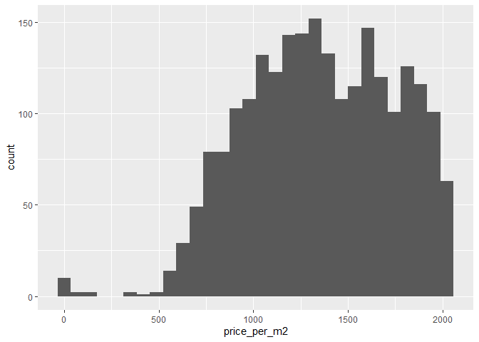

## Introduction

For this analysis, we will examine the effect that area (measured in squared meters) has on the value of apartment, for residential use, in Santo Domingo, Dominican Republic. Prices and apartment's characteristics are collect via web scraping (you can see [here](https://github.com/augustojimenez/residential_webscraping) how this was done). Specifically, data were retrieved on 22nd of march, 2022, from supercasas.com, a beacon on the online Dominican real estate market.

In this article, I will guide you step by step how I performed the data cleaning process and the reasons an particular step was chosen. Without further ado, let's begin.

## Loading libraries and data

First, I loaded the libraries used throughout the cleaning process, set the seed (so, results are reproducible), and cleared the objects from the work space. Finally, I loaded the data retrieved from supercasas.com on different dates.


```r
rm(list = ls())
getwd()
```

```
## [1] "C:/Users/Augus/OneDrive/Documents/GitHub/Portfolio/Dominican Real Estate Market/1_Data Cleaning/0_source"
```

```r
options(scipen = 999)

library(robustbase)
library(tidyverse)
library(caret)

set.seed(1234)

path <- "../../0_Data Collection/1_data/0_raw/housing price/"
housing_files <- list.files(path)
housing <- read_csv(paste0(path, housing_files))
```

The data cleaning process involves seeing and slightly analyzing the data. As I will also perform the Exploratory Data Analysis and some statistical modelling in a later stage, I must not see and clean the whole dataset. Doing so might bias results.

I am interested in the data retrieved on March 22nd, 2022 for residential apartments listed in Santo Domingo. Here I filtered the dataset to match this criteria. Then, we split the dataset into training (70%) and testing (30%). I'll only use the training set to cleaning the dataset. In a later stage, this process will be applied to the test set.


```r
housing <- housing %>%
  filter(date ==  "2022-03-22",
         usage == "Residencial",
         province %in% c("Santo Domingo", "Santo Domingo Centro (D.N.)")) %>%
  rename(location = neighborhood) %>%
  select(-c(date, usage, city, province))

inTrain <- createDataPartition(housing$price.usd, p = 0.7, list = FALSE)

training <- housing[inTrain, ]
testing <- housing[-inTrain, ]
```

On the 22nd of March, 2022, there were 5,932 apartments for residential use listed in supercasas.com that were located in Santo Domingo. For creating the data cleaning process, I'll use a (randomly selected) subset of 4,154 apartments with the same overall characteristics.


```r
dim(housing)
```

```
## [1] 5932   21
```

```r
dim(training)
```

```
## [1] 4154   21
```

```r
dim(testing)
```

```
## [1] 1778   21
```

## Data cleaning

First, let's see what's on the dataset:


```r
glimpse(training)
```

```
## Rows: 4,154
## Columns: 21
## $ id        <chr> "/apartamentos-venta-piantini/1265273/", "/apartamentos-vent…
## $ parking   <dbl> 3, 2, 2, 3, NA, 3, 2, 2, 2, 1, 3, 1, 3, 3, 3, 1, 2, 1, 2, 2,…
## $ bathrooms <dbl> 3.0, 2.5, 2.5, 3.5, 3.5, 3.5, 3.5, 3.5, 2.5, 2.0, 3.0, 1.5, …
## $ bedrooms  <dbl> 2, 2, 2, 3, 3, 3, 3, 3, 2, 1, 2, 1, 3, 3, 3, 1, 1, 1, 2, 3, …
## $ currency  <chr> "US$", "US$", "US$", "US$", "US$", "US$", "US$", "US$", "US$…
## $ price     <dbl> 258000, 220000, 296250, 408825, 390000, 370000, 275000, 3000…
## $ seller    <chr> "BAEZ MUESES INMOBILIARIA", "Premium Real Estate", "Algonovo…
## $ location  <chr> "Piantini", "Piantini", "Piantini", "Piantini", "Piantini", …
## $ status    <chr> "Segundo Uso", "Segundo Uso", "En Construcción", "En Constru…
## $ area      <dbl> 180, 100, 153, 185, NA, 217, NA, NA, 142, NA, 225, 70, 175, …
## $ story     <dbl> 2, 2, 4, 3, NA, NA, NA, NA, NA, NA, NA, NA, 3, 13, NA, NA, N…
## $ planta    <lgl> TRUE, FALSE, TRUE, TRUE, FALSE, FALSE, TRUE, TRUE, TRUE, TRU…
## $ lift      <lgl> TRUE, TRUE, TRUE, TRUE, FALSE, TRUE, TRUE, TRUE, TRUE, TRUE,…
## $ pool      <lgl> TRUE, TRUE, TRUE, TRUE, TRUE, FALSE, FALSE, FALSE, FALSE, FA…
## $ pozo      <lgl> TRUE, FALSE, TRUE, TRUE, FALSE, FALSE, FALSE, FALSE, FALSE, …
## $ terraza   <lgl> TRUE, TRUE, TRUE, TRUE, FALSE, TRUE, FALSE, FALSE, FALSE, TR…
## $ lobby     <lgl> TRUE, TRUE, TRUE, TRUE, TRUE, TRUE, FALSE, FALSE, FALSE, FAL…
## $ balcon    <lgl> TRUE, TRUE, TRUE, TRUE, FALSE, FALSE, FALSE, FALSE, FALSE, F…
## $ jacuzzi   <lgl> FALSE, FALSE, FALSE, FALSE, FALSE, FALSE, FALSE, FALSE, FALS…
## $ gimnasio  <lgl> TRUE, TRUE, TRUE, TRUE, TRUE, TRUE, FALSE, FALSE, FALSE, FAL…
## $ price.usd <dbl> 258000, 220000, 296250, 408825, 390000, 370000, 275000, 3000…
```

Our training dataset contains 4,154 observations and 21 variables. Of them, we can highlight `price`, `currency` and `price.usd`. Where `price` and `currency` is the actual price shown in the listing's site. Any apartment can be listed in local currency or US dollars, depending on the seller's preference. I created `price.usd` on the data collection step to show prices on the same currency: US dollars. Hence, if prices were stated in local currency, they were converted into US dollars. Otherwise, they stay the same. I'll drop `currency` and `price`, and keep `price.usd`. Then, and for simplicity's sake, I'll rename `price.usd` as simply `price`.


```r
training <- training %>%
  select(-c(currency, price)) %>%
  rename(price = price.usd)
```

When looking at the proportion of `NA`s are present per variable, over 50% of listings did not provide information regarding the floor the apartment is located at. And so, I removed that variable. The proportion of missing values for all other variables is acceptable.


```r
apply(training, 2, 
      \(x) {
        n <- length(x)
        na <- x %>%
          is.na() %>%
          sum()
        prop.na <- na / n * 100
        })
```

```
##         id    parking  bathrooms   bedrooms     seller   location     status 
##  0.0000000  6.7645643  5.0072220  2.4795378  0.0000000  0.4573905  6.6441984 
##       area      story     planta       lift       pool       pozo    terraza 
## 10.7125662 51.4443909  0.0000000  0.0000000  0.0000000  0.0000000  0.0000000 
##      lobby     balcon    jacuzzi   gimnasio      price 
##  0.0000000  0.0000000  0.0000000  0.0000000  0.0000000
```

```r
training <- training %>%
  select(-c(story))
```

Before implementing some formal procedure for removing outliers, let's analyse the data at hand. First, we can see that `area` has some outstanding observations: a minimum value of 30 and a maximum of 650,000 squared meters.


```r
summary(training)
```

```
##       id               parking         bathrooms        bedrooms    
##  Length:4154        Min.   : 1.000   Min.   :1.000   Min.   :1.000  
##  Class :character   1st Qu.: 2.000   1st Qu.:2.000   1st Qu.:2.000  
##  Mode  :character   Median : 2.000   Median :2.500   Median :3.000  
##                     Mean   : 2.012   Mean   :2.719   Mean   :2.554  
##                     3rd Qu.: 2.000   3rd Qu.:3.500   3rd Qu.:3.000  
##                     Max.   :25.000   Max.   :6.500   Max.   :6.000  
##                     NA's   :281      NA's   :208     NA's   :103    
##     seller            location            status               area         
##  Length:4154        Length:4154        Length:4154        Min.   :    30.0  
##  Class :character   Class :character   Class :character   1st Qu.:   100.0  
##  Mode  :character   Mode  :character   Mode  :character   Median :   151.0  
##                                                           Mean   :   582.8  
##                                                           3rd Qu.:   220.0  
##                                                           Max.   :650000.0  
##                                                           NA's   :445       
##    planta           lift            pool            pozo        
##  Mode :logical   Mode :logical   Mode :logical   Mode :logical  
##  FALSE:1516      FALSE:1283      FALSE:2732      FALSE:2962     
##  TRUE :2638      TRUE :2871      TRUE :1422      TRUE :1192     
##                                                                 
##                                                                 
##                                                                 
##                                                                 
##   terraza          lobby           balcon         jacuzzi       
##  Mode :logical   Mode :logical   Mode :logical   Mode :logical  
##  FALSE:2424      FALSE:1665      FALSE:1307      FALSE:3372     
##  TRUE :1730      TRUE :2489      TRUE :2847      TRUE :782      
##                                                                 
##                                                                 
##                                                                 
##                                                                 
##   gimnasio           price          
##  Mode :logical   Min.   :        1  
##  FALSE:1991      1st Qu.:   138000  
##  TRUE :2163      Median :   210000  
##                  Mean   :   496043  
##                  3rd Qu.:   300000  
##                  Max.   :257500000  
## 
```

By viewing the "largest apartments", some things become apparent.

1.  First, there are repeated observations on this small sample: see the third and fourth rows, for instance.

2.  Second, the first four rows are obviously typos: the seller typed 650,000 instead of 650 squared meters, to cited the first case.

3.  Third, the apartment listed on the fifth row is no longer available rising some doubts on its veracity.

4.  Last, the sixth "apartment" is actually a house. When analyzing the "smallest apartments", everything seems in order.


```r
training %>%
  arrange(desc(area)) %>%
  head(10)
```

```
## # A tibble: 10 × 18
##    id      parking bathrooms bedrooms seller location status   area planta lift 
##    <chr>     <dbl>     <dbl>    <dbl> <chr>  <chr>    <chr>   <dbl> <lgl>  <lgl>
##  1 /apart…       5       3.5        3 Flavi… Piantini Segun… 650000 TRUE   TRUE 
##  2 /apart…       3       3.5        3 Flavi… Piantini Segun… 400000 TRUE   TRUE 
##  3 /apart…       2       3.5        3 Premi… Alma Ro… En Co… 220000 TRUE   TRUE 
##  4 /apart…       2       3.5        3 Premi… Alma Ro… En Co… 220000 TRUE   TRUE 
##  5 /apart…       3       3.5        3 Gineb… Los Cac… Segun…   2016 FALSE  FALSE
##  6 /apart…      NA       5.5        5 Vícto… Cuesta … Segun…   1431 TRUE   FALSE
##  7 /apart…      NA       5          4 Patri… Paraiso  Segun…    952 TRUE   TRUE 
##  8 /apart…       4       6          4 Paez … La Espe… Segun…    890 FALSE  FALSE
##  9 /apart…      NA      NA          4 Paez … Anacaona <NA>      890 FALSE  FALSE
## 10 /apart…       5       4.5        4 Flavi… Anacaona Segun…    854 FALSE  TRUE 
## # … with 8 more variables: pool <lgl>, pozo <lgl>, terraza <lgl>, lobby <lgl>,
## #   balcon <lgl>, jacuzzi <lgl>, gimnasio <lgl>, price <dbl>
```

So, to fix (1) I eliminated duplicates. To solve (2), I divided by 1,000 the area of those apartments with over 10,000 squared meters of area. Finally, as for (3), I removed those apartments that are obviously not of interest.


```r
training <- training %>%
  filter(id != "/apartamentos-venta-cuesta-hermosa-ii/1236477/",
         id != "/apartamentos-venta-los-cacicazgos/1272251/") %>%
  mutate(area = ifelse(area > 10000, area / 1000, area)) %>%
  unique()
```

Let's do the same with `price`. But viewing `price` or `area` alone might be misleading as an apartment with 30 squared meters could be worth 20,000 dollars, but one with 280 squared meters could hardly be worth \$10,256. What I mean is, price must be analyse in regards with area. Price per squared meter could tell us more about how extreme of a value it is.


```r
summary(training$price)
```

```
##      Min.   1st Qu.    Median      Mean   3rd Qu.      Max. 
##         1    142000    215000    528651    315000 257500000
```

```r
ggplot(training, aes(price)) +
  geom_histogram()
```

```
## `stat_bin()` using `bins = 30`. Pick better value with `binwidth`.
```

<!-- -->


```r
summary(training$area)
```

```
##    Min. 1st Qu.  Median    Mean 3rd Qu.    Max.    NA's 
##    30.0   102.0   155.0   184.8   226.0   952.0     365
```

```r
ggplot(training, aes(area)) +
  geom_histogram()
```

```
## `stat_bin()` using `bins = 30`. Pick better value with `binwidth`.
```

```
## Warning: Removed 365 rows containing non-finite values (stat_bin).
```

<!-- -->

## Some feature engineering

When analysed individually, `price` and `area` show some pretty hardcore outliers. What about price in relation to area, that's price per squared meter, or area in relation to the number of bedrooms? Let's do some feature engineering to create measures for these relations:


```r
training <- training %>%
  mutate(price_per_m2 = price / area,
         area_per_br = area / bedrooms)
```

Well, I still got similar results ...


```r
summary(training$price_per_m2)
```

```
##    Min. 1st Qu.  Median    Mean 3rd Qu.    Max.    NA's 
##       0    1100    1472    3566    1864 1984252     365
```

```r
ggplot(training, aes(price_per_m2)) +
  geom_histogram()
```

```
## `stat_bin()` using `bins = 30`. Pick better value with `binwidth`.
```

```
## Warning: Removed 365 rows containing non-finite values (stat_bin).
```

<!-- -->

It's still rather blurry... I cannot see a clear pattern in the data distribution. Let's filter data below the third quartile, based on price per squared meter.


```r
training %>%
  filter(price_per_m2 < 1864) %>%
  ggplot(aes(price)) +
  geom_histogram()
```

```
## `stat_bin()` using `bins = 30`. Pick better value with `binwidth`.
```

<!-- -->

## Removing outliers

So far, I have removed some obvious outliers and determined the distribution of price per squared meter (right skewed). Knowing that, I can pick a suitable method for detecting outliers. For right skewed distributions, I cannot simply use Z scores (suitable for normal distributions).

I think that anything below \$200 per squared meter seems rather dubious, don't you think? But that's very subjective, and we don't want that, do we? Let's filter them out. But let's use something less subjective. The library `robustbase` contains some useful functions for basic robust statistics. It includes, among other things, an implementation of the methods proposed by Hubert and Vandervieren (2008) for outlier detection for skewed distributions. Using this, I got these cutoff values for `price_per_m2`:


```r
(cutoff <- adjboxStats(training$price_per_m2)$fence)
```

```
## The default of 'doScale' is FALSE now for stability;
##   set options(mc_doScale_quiet=TRUE) to suppress this (once per session) message
```

```
## [1]  226.7685 3270.8771
```

When I filtered using these new cutoff values, the distribution looks a lot better:


```r
training <- training %>%
  filter(between(price_per_m2, cutoff[1], cutoff[2]))

summary(training$price_per_m2)
```

```
##    Min. 1st Qu.  Median    Mean 3rd Qu.    Max. 
##   268.9  1100.0  1456.3  1505.9  1847.7  3219.2
```

```r
ggplot(training, aes(price)) +
  geom_histogram()
```

```
## `stat_bin()` using `bins = 30`. Pick better value with `binwidth`.
```

<!-- -->

By the way, when I analysed a sample of the apartments tagged as outliers, it turned out that they were typos. Either they were listed in the wrong currency or it missed some zeros.

I used the same method to remove \`area_per_br\` outliers:


```r
summary(training$area_per_br)
```

```
##    Min. 1st Qu.  Median    Mean 3rd Qu.    Max.    NA's 
##   21.25   51.50   64.67   70.37   81.50  248.33      25
```

```r
(cutoff <- adjboxStats(training$area_per_br)$fence)
```

```
## [1]  27.28568 153.12550
```

```r
training <- training %>%
  filter(between(area_per_br, cutoff[1], cutoff[2]))

summary(training$area_per_br)
```

```
##    Min. 1st Qu.  Median    Mean 3rd Qu.    Max. 
##   27.33   51.67   64.00   68.33   80.00  150.00
```

Many times, the same apartment is listed by different sellers. So, eliminating duplicates is not enough to remove confliting. Some seller are not as rigourous as to list all the amaneties, so we are going to keep the most complete listing:

## Some more feature engineering

`status` refers to the current status of the apartment listed. It should be an ordered categorical variable as it goes through several stages from blueprint up to used:


```r
training <- training %>%
  mutate(status = case_when(status == "En Planos" ~ "In blueprint",
                            status == "En Construcción" ~ "Building",
                            status == "Nueva" ~ "New",
                            status == "Remodelada" ~ "Rebuilt",
                            status == "A Remodelar" ~ "Rebuilding",
                            status == "Segundo Uso" ~ "Used",
                            status == "Fideicomiso" ~ "Trust",
                            TRUE ~ status),
         status = factor(status, levels = c("In blueprint", "Building",
                                            "New", "Rebuilt", "Rebuilding",
                                            "Used", "Other")))
```

There's an exception for this: Trust, and it refers to the way the building company is structured. Meaning that the building company is building the apartments through a trust fund. But the actual stage is unknown. Let's see how many are there.


```r
training[training$status == "Trust" & !is.na(training$status), ]
```

```
## # A tibble: 0 × 20
## # … with 20 variables: id <chr>, parking <dbl>, bathrooms <dbl>,
## #   bedrooms <dbl>, seller <chr>, location <chr>, status <fct>, area <dbl>,
## #   planta <lgl>, lift <lgl>, pool <lgl>, pozo <lgl>, terraza <lgl>,
## #   lobby <lgl>, balcon <lgl>, jacuzzi <lgl>, gimnasio <lgl>, price <dbl>,
## #   price_per_m2 <dbl>, area_per_br <dbl>
```

There are only two listings with this status. Let's remove them.


```r
Training <- training %>%
  filter(status != "Trust")
```

Our final data frame has 20 columns wide and 2,851 rows long. I'll store it in a new location with a new name.


```r
glimpse(training)
```

```
## Rows: 2,851
## Columns: 20
## $ id           <chr> "/apartamentos-venta-piantini/1265273/", "/apartamentos-v…
## $ parking      <dbl> 3, 2, 2, 3, 3, 2, 3, 3, 3, 3, 1, 2, 1, 2, 2, 3, 2, 3, 3, …
## $ bathrooms    <dbl> 3.0, 2.5, 2.5, 3.5, 3.5, 2.5, 3.0, 3.5, 3.5, 3.5, 1.5, 1.…
## $ bedrooms     <dbl> 2, 2, 2, 3, 3, 2, 2, 3, 3, 3, 1, 1, 1, 3, 3, 3, 2, 3, 3, …
## $ seller       <chr> "BAEZ MUESES INMOBILIARIA", "Premium Real Estate", "Algon…
## $ location     <chr> "Piantini", "Piantini", "Piantini", "Piantini", "Piantini…
## $ status       <fct> Used, Used, Building, Building, NA, NA, NA, In blueprint,…
## $ area         <dbl> 180, 100, 153, 185, 217, 142, 225, 175, 200, 340, 67, 103…
## $ planta       <lgl> TRUE, FALSE, TRUE, TRUE, FALSE, TRUE, FALSE, TRUE, TRUE, …
## $ lift         <lgl> TRUE, TRUE, TRUE, TRUE, TRUE, TRUE, TRUE, TRUE, FALSE, TR…
## $ pool         <lgl> TRUE, TRUE, TRUE, TRUE, FALSE, FALSE, FALSE, FALSE, TRUE,…
## $ pozo         <lgl> TRUE, FALSE, TRUE, TRUE, FALSE, FALSE, FALSE, FALSE, FALS…
## $ terraza      <lgl> TRUE, TRUE, TRUE, TRUE, TRUE, FALSE, FALSE, FALSE, FALSE,…
## $ lobby        <lgl> TRUE, TRUE, TRUE, TRUE, TRUE, FALSE, FALSE, TRUE, TRUE, T…
## $ balcon       <lgl> TRUE, TRUE, TRUE, TRUE, FALSE, FALSE, FALSE, FALSE, TRUE,…
## $ jacuzzi      <lgl> FALSE, FALSE, FALSE, FALSE, FALSE, FALSE, FALSE, TRUE, FA…
## $ gimnasio     <lgl> TRUE, TRUE, TRUE, TRUE, TRUE, FALSE, FALSE, TRUE, TRUE, T…
## $ price        <dbl> 258000, 220000, 296250, 408825, 370000, 155000, 280000, 3…
## $ price_per_m2 <dbl> 1433.333, 2200.000, 1936.275, 2209.865, 1705.069, 1091.54…
## $ area_per_br  <dbl> 90.00000, 50.00000, 76.50000, 61.66667, 72.33333, 71.0000…
```

```r
write_csv(training, "../1_data/training_set.csv")
```
