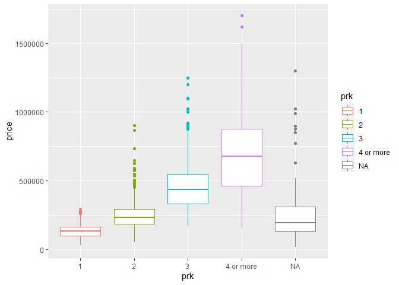
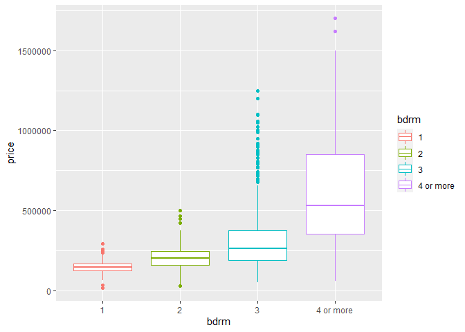

## Introduction

For this analysis, we will examine the effect that area (measured in squared meters) has on the value of apartment, for residential use, in Santo Domingo, Domincan Republic. Prices and apartment's characteristics are collect via web scraping. Specifically, data were retrieved on 2nd of August, 2022, from supercasas.com, a beacon on the online dominican real estate market.

## Loading the training dataset

Let's start by loading the libraries and the dataset to be used here. I already cleaned the data by detecting and removing outliers, and performed some initial feature engineering on it. Now, I have to a bit deeper analyzing each feature and how they relate to each other.


```r
rm(list = ls())

library(tidyverse)
```

```
## ── Attaching packages ─────────────────────────────────────── tidyverse 1.3.1 ──
```

```
## ✔ ggplot2 3.3.6     ✔ purrr   0.3.4
## ✔ tibble  3.1.7     ✔ dplyr   1.0.9
## ✔ tidyr   1.2.0     ✔ stringr 1.4.0
## ✔ readr   2.1.2     ✔ forcats 0.5.1
```

```
## ── Conflicts ────────────────────────────────────────── tidyverse_conflicts() ──
## ✖ dplyr::filter() masks stats::filter()
## ✖ dplyr::lag()    masks stats::lag()
```

```r
library(pastecs)
```

```
## 
## Attaching package: 'pastecs'
```

```
## The following objects are masked from 'package:dplyr':
## 
##     first, last
```

```
## The following object is masked from 'package:tidyr':
## 
##     extract
```

```r
library(GGally)
```

```
## Registered S3 method overwritten by 'GGally':
##   method from   
##   +.gg   ggplot2
```

```r
training <- read_csv("../../1_Data Cleaning/1_data/training_set.csv")
```

```
## Rows: 2897 Columns: 20
```

```
## ── Column specification ────────────────────────────────────────────────────────
## Delimiter: ","
## chr (4): id, seller, location, status
## dbl (7): parking, bathrooms, bedrooms, area, price, price_per_m2, area_per_br
## lgl (9): planta, lift, pool, pozo, terraza, lobby, balcon, jacuzzi, gimnasio
## 
## ℹ Use `spec()` to retrieve the full column specification for this data.
## ℹ Specify the column types or set `show_col_types = FALSE` to quiet this message.
```

```r
testing <- read_csv("../../1_Data Cleaning/1_data/testing_set.csv")
```

```
## Rows: 1375 Columns: 20
## ── Column specification ────────────────────────────────────────────────────────
## Delimiter: ","
## chr (4): id, seller, location, status
## dbl (7): parking, bathrooms, bedrooms, area, price, price_per_m2, area_per_br
## lgl (9): planta, lift, pool, pozo, terraza, lobby, balcon, jacuzzi, gimnasio
## 
## ℹ Use `spec()` to retrieve the full column specification for this data.
## ℹ Specify the column types or set `show_col_types = FALSE` to quiet this message.
```

## Reviewing the dataset

Let's start by review the dataset. It contains 20 features for 2,897 observations. Of these 20 features, only `area`, `price`, `parking`, `bedrooms`, `bathrooms`, `price_per_m2` and `area_per_br` are numerical. All others are categorical, such as `status` and `lift`.


```r
glimpse(training)
```

```
## Rows: 2,897
## Columns: 20
## $ id           <chr> "/apartamentos-venta-piantini/1286053/", "/apartamentos-v…
## $ parking      <dbl> 1, 4, 2, 2, NA, 2, 2, 2, 2, 2, 2, 2, 2, 3, 2, 2, 3, 2, 1,…
## $ bathrooms    <dbl> 2.0, 4.5, 2.0, 2.0, 3.5, 3.5, 2.0, 3.5, 2.0, 2.5, 2.0, 3.…
## $ bedrooms     <dbl> 1, 4, 3, 3, 3, 3, 3, 3, 3, 2, 3, 3, 3, 3, 3, 2, 3, 2, 1, …
## $ seller       <chr> "KW Capital", "Innova By Bello Jaquez", "Premium Real Est…
## $ location     <chr> "Piantini", "Piantini", "Piantini", "Piantini", "Piantini…
## $ status       <chr> "New", "Used", "Used", "Used", "Used", "Used", "Rebuildin…
## $ area         <dbl> 76, 336, 180, 180, 280, 230, 176, 190, 155, 123, 153, 290…
## $ planta       <lgl> TRUE, TRUE, FALSE, FALSE, FALSE, TRUE, FALSE, TRUE, TRUE,…
## $ lift         <lgl> TRUE, TRUE, FALSE, FALSE, FALSE, TRUE, FALSE, TRUE, FALSE…
## $ pool         <lgl> TRUE, FALSE, FALSE, FALSE, FALSE, FALSE, FALSE, TRUE, FAL…
## $ pozo         <lgl> TRUE, FALSE, FALSE, FALSE, FALSE, FALSE, FALSE, FALSE, FA…
## $ terraza      <lgl> TRUE, FALSE, FALSE, FALSE, FALSE, FALSE, FALSE, TRUE, FAL…
## $ lobby        <lgl> TRUE, TRUE, FALSE, FALSE, FALSE, TRUE, FALSE, TRUE, TRUE,…
## $ balcon       <lgl> TRUE, FALSE, FALSE, FALSE, FALSE, FALSE, FALSE, TRUE, TRU…
## $ jacuzzi      <lgl> TRUE, FALSE, FALSE, FALSE, FALSE, FALSE, FALSE, FALSE, FA…
## $ gimnasio     <lgl> TRUE, FALSE, FALSE, FALSE, FALSE, FALSE, FALSE, TRUE, FAL…
## $ price        <dbl> 227000.0, 340000.0, 200000.0, 200000.0, 300000.0, 270000.…
## $ price_per_m2 <dbl> 2986.8421, 1011.9048, 1111.1111, 1111.1111, 1071.4286, 11…
## $ area_per_br  <dbl> 76.00000, 84.00000, 60.00000, 60.00000, 93.33333, 76.6666…
```

## Univariate analysis

So, let's calculate some descriptive statistics on these. For this, I used `pastec` library. it includes a nice function that calculates the number of observations, number of null values, mean, and some other statistics that can give me an idea on these features.


```r
myvars <- c("price", "area", "parking", "bedrooms", "bathrooms", "price_per_m2",
            "area_per_br")

pastecs::stat.desc(training[myvars], norm = TRUE)
```

```
##                     price         area      parking      bedrooms     bathrooms
## nbr.val      2.897000e+03 2.897000e+03 2.781000e+03  2.897000e+03  2.847000e+03
## nbr.null     0.000000e+00 0.000000e+00 0.000000e+00  0.000000e+00  0.000000e+00
## nbr.na       0.000000e+00 0.000000e+00 1.160000e+02  0.000000e+00  5.000000e+01
## min          2.000000e+04 3.000000e+01 1.000000e+00  1.000000e+00  1.000000e+00
## max          1.700000e+06 7.200000e+02 7.000000e+00  6.000000e+00  6.500000e+00
## range        1.680000e+06 6.900000e+02 6.000000e+00  5.000000e+00  5.500000e+00
## sum          7.805449e+08 5.003390e+05 5.544000e+03  7.277000e+03  7.719000e+03
## median       2.250000e+05 1.500000e+02 2.000000e+00  3.000000e+00  2.500000e+00
## mean         2.694321e+05 1.727094e+02 1.993528e+00  2.511909e+00  2.711275e+00
## SE.mean      3.418187e+03 1.800643e+00 1.488039e-02  1.511145e-02  1.625032e-02
## CI.mean.0.95 6.702324e+03 3.530670e+00 2.917772e-02  2.963027e-02  3.186360e-02
## var          3.384855e+10 9.392982e+03 6.157854e-01  6.615467e-01  7.518159e-01
## std.dev      1.839797e+05 9.691740e+01 7.847200e-01  8.133552e-01  8.670732e-01
## coef.var     6.828426e-01 5.611590e-01 3.936339e-01  3.237996e-01  3.198027e-01
## skewness     2.480541e+00 1.261935e+00 9.846773e-01 -5.464644e-01  3.857991e-02
## skew.2SE     2.726715e+01 1.387172e+01 1.060530e+01 -6.006966e+00  4.204147e-01
## kurtosis     9.595150e+00 1.739709e+00 2.274214e+00 -1.731701e-01 -3.572590e-01
## kurt.2SE     5.275512e+01 9.565099e+00 1.225141e+01 -9.521072e-01 -1.947251e+00
## normtest.W   7.901780e-01 9.021799e-01 8.044554e-01  7.897759e-01  9.145809e-01
## normtest.p   1.006719e-51 1.286388e-39 8.772174e-50  9.341870e-52  2.257143e-37
##               price_per_m2  area_per_br
## nbr.val       2.897000e+03 2.897000e+03
## nbr.null      0.000000e+00 0.000000e+00
## nbr.na        0.000000e+00 0.000000e+00
## min           3.148898e+02 2.666667e+01
## max           3.588517e+03 1.490000e+02
## range         3.273627e+03 1.223333e+02
## sum           4.667959e+06 1.963081e+05
## median        1.565217e+03 6.400000e+01
## mean          1.611308e+03 6.776256e+01
## SE.mean       1.052454e+01 4.496987e-01
## CI.mean.0.95  2.063634e+01 8.817618e-01
## var           3.208888e+05 5.858572e+02
## std.dev       5.664705e+02 2.420449e+01
## coef.var      3.515594e-01 3.571955e-01
## skewness      4.760365e-01 8.780841e-01
## skew.2SE      5.232794e+00 9.652270e+00
## kurtosis     -1.457537e-01 6.271674e-01
## kurt.2SE     -8.013686e-01 3.448231e+00
## normtest.W    9.791666e-01 9.475641e-01
## normtest.p    3.346246e-20 5.767478e-31
```

The mean and median for `price`, `price_per_m2`, `area_per_br` and `area` look substantially different, and not so much for the other variables. This suggests that they might not follow a normal distribution as shown in the cleaning process. Let's plot the histogram for all numerical variables.


```r
g <- ggplot(training)
g + geom_histogram(aes(price))
```

```
## `stat_bin()` using `bins = 30`. Pick better value with `binwidth`.
```

<!-- -->

```r
g + geom_histogram(aes(area))
```

```
## `stat_bin()` using `bins = 30`. Pick better value with `binwidth`.
```

<!-- -->

```r
g + geom_histogram(aes(parking))
```

```
## `stat_bin()` using `bins = 30`. Pick better value with `binwidth`.
```

```
## Warning: Removed 116 rows containing non-finite values (stat_bin).
```

<!-- -->

```r
g + geom_histogram(aes(bedrooms))
```

```
## `stat_bin()` using `bins = 30`. Pick better value with `binwidth`.
```

<!-- -->

```r
g + geom_histogram(aes(bathrooms))
```

```
## `stat_bin()` using `bins = 30`. Pick better value with `binwidth`.
```

```
## Warning: Removed 50 rows containing non-finite values (stat_bin).
```

<!-- -->

```r
g + geom_histogram(aes(price_per_m2))
```

```
## `stat_bin()` using `bins = 30`. Pick better value with `binwidth`.
```

<!-- -->

```r
g + geom_histogram(aes(area_per_br))
```

```
## `stat_bin()` using `bins = 30`. Pick better value with `binwidth`.
```

<!-- -->

So, `price` and `area` are right-skewed, and so are the calculated features `price_per_m2` and `area_per_br`.

From the previous plots, it is evident that `parking`, `bedrooms`, and `bathrooms` are categorical, despite initial impressions.

## Bivariate analysis

Let's start by looking at feature-pairwise plots:


```r
ggpairs(training[myvars])
```

```
## Warning in ggally_statistic(data = data, mapping = mapping, na.rm = na.rm, :
## Removed 116 rows containing missing values
```

```
## Warning in ggally_statistic(data = data, mapping = mapping, na.rm = na.rm, :
## Removed 50 rows containing missing values
```

```
## Warning in ggally_statistic(data = data, mapping = mapping, na.rm = na.rm, :
## Removed 116 rows containing missing values
```

```
## Warning in ggally_statistic(data = data, mapping = mapping, na.rm = na.rm, :
## Removed 50 rows containing missing values
```

```
## Warning: Removed 116 rows containing missing values (geom_point).
## Removed 116 rows containing missing values (geom_point).
```

```
## Warning: Removed 116 rows containing non-finite values (stat_density).
```

```
## Warning in ggally_statistic(data = data, mapping = mapping, na.rm = na.rm, :
## Removed 116 rows containing missing values
```

```
## Warning in ggally_statistic(data = data, mapping = mapping, na.rm = na.rm, :
## Removed 153 rows containing missing values
```

```
## Warning in ggally_statistic(data = data, mapping = mapping, na.rm = na.rm, :
## Removed 116 rows containing missing values

## Warning in ggally_statistic(data = data, mapping = mapping, na.rm = na.rm, :
## Removed 116 rows containing missing values
```

```
## Warning: Removed 116 rows containing missing values (geom_point).
```

```
## Warning in ggally_statistic(data = data, mapping = mapping, na.rm = na.rm, :
## Removed 50 rows containing missing values
```

```
## Warning: Removed 50 rows containing missing values (geom_point).
## Removed 50 rows containing missing values (geom_point).
```

```
## Warning: Removed 153 rows containing missing values (geom_point).
```

```
## Warning: Removed 50 rows containing missing values (geom_point).
```

```
## Warning: Removed 50 rows containing non-finite values (stat_density).
```

```
## Warning in ggally_statistic(data = data, mapping = mapping, na.rm = na.rm, :
## Removed 50 rows containing missing values

## Warning in ggally_statistic(data = data, mapping = mapping, na.rm = na.rm, :
## Removed 50 rows containing missing values
```

```
## Warning: Removed 116 rows containing missing values (geom_point).
```

```
## Warning: Removed 50 rows containing missing values (geom_point).
```

```
## Warning: Removed 116 rows containing missing values (geom_point).
```

```
## Warning: Removed 50 rows containing missing values (geom_point).
```

<!-- -->

Some observations from the previous plot:

-   `price` and `area` are highly correlated, as expected.

-   `price` is also highly correlated with `parking` and `area_per_ber`.

-   `price_per_m2` is not highly correlated with other variables, except for `bedrooms`. The relationship is negative. This suggests that `price_per_m2` is sort of fixed for this location and correlates with the number of bedrooms (not considering categorical variables yet). This makes sense. Would you pay the same for an apartment with 90 squared meters with two bedrooms as with another with three bedrooms in the same area? Probably not, because it would mean less room (lol) for other spaces (such as kitchen, living room, etc.)

Now, let's zoom in at the plot of area against price:


```r
ggplot(training, aes(area, price)) +
  geom_point()
```

<!-- -->

The relationship is positive, as expected. But, it seems as if the variance changes as area increases. That is, my certainty about the asking price for any apartment decreases as the area increases. This is preliminary as I am not yet controlling for other variables.

Viewing how prices changes as the amount of parking spots increases


```r
summary(as.factor(training$parking))
```

```
##    1    2    3    4    5    6    7 NA's 
##  687 1572  398  108   10    5    1  116
```

```r
ggplot(training, aes(x = factor(parking), y = price, colour = factor(parking))) +
  geom_boxplot()
```

<!-- -->

Now, I use Kabacoff's function (sourced from his personal site) to compare differences in price by the number of parking spots. This function uses the Wilcoxon signed rank test while controlling for Type I errors (using the method developed by Holm). Find out more on this at his website or in his book: R in Action, section 7.5.


```r
source("http://www.statmethods.net/RiA/wmc.txt")
wmc(price ~ parking, data = training, method = "holm")
```

```
## Warning in xtfrm.data.frame(x): cannot xtfrm data frames
```

```
## Descriptive Statistics
## 
##                1      7         2        3        4      5       6
## n         687.00      1   1572.00    398.0    108.0     10       5
## median 132775.00 150000 235000.00 436500.0 642500.0 755000 1250000
## mad     48592.21      0  75316.08 159379.5 337291.5 133434       0
## 
## Multiple Comparisons (Wilcoxon Rank Sum Tests)
## Probability Adjustment = holm
## 
##    Group.1 Group.2        W             p    
## 1        1       7    242.5  8.502658e-01    
## 2        1       2 136894.5 1.991842e-174 ***
## 3        1       3   1585.0 3.401939e-161 ***
## 4        1       4    459.5  5.142856e-60 ***
## 5        1       5      0.0  8.303206e-07 ***
## 6        1       6     12.5  1.556220e-03  **
## 7        7       2    202.5  7.966351e-01    
## 8        7       3      0.0  5.976591e-01    
## 9        7       4      0.5  5.976591e-01    
## 10       7       5      0.0  7.736446e-01    
## 11       7       6      0.0  7.966351e-01    
## 12       2       3  78114.0 2.499969e-117 ***
## 13       2       4  10364.0  1.716102e-51 ***
## 14       2       5     61.5  8.564541e-07 ***
## 15       2       6    619.5  1.243339e-02   *
## 16       3       4  11587.0  3.166786e-12 ***
## 17       3       5    423.5  2.751350e-04 ***
## 18       3       6    355.5  1.355082e-01    
## 19       4       5    457.0  8.502658e-01    
## 20       4       6    121.5  3.482542e-01    
## 21       5       6     10.0  5.976591e-01    
## ---
## Signif. codes:  0 '***' 0.001 '**' 0.01 '*' 0.05 '.' 0.1 ' ' 1
```

This confirms what can be seem on the plot: price stop increasing from 4 parking spots onwards. And so, I grouped them as one:


```r
training <- training %>%
  mutate(prk = ifelse(as.numeric(parking) >= 4, "4 or more", parking),
         prk = factor(prk, ordered = is.ordered(prk)))

testing <- testing %>%
  mutate(prk = ifelse(as.numeric(parking) >= 4, "4 or more", parking),
         prk = factor(prk, ordered = is.ordered(prk)))

summary(training$prk)
```

```
##         1         2         3 4 or more      NA's 
##       687      1572       398       124       116
```

```r
ggplot(training, aes(x = prk, y = price, colour = prk)) +
  geom_boxplot()
```

<!-- -->

I'll repeat the same process with `status`. This feature tells me whether an apartment is in construction, newly constructed or used.


```r
training$status <- as.factor(training$status)

testing$status <- as.factor(testing$status)

summary(training$status)
```

```
##     Building In blueprint          New   Rebuilding      Rebuilt         Used 
##          849          164          800            2           28          912 
##         NA's 
##          142
```

```r
ggplot(training, aes(x = status, y = price, colour = status)) + geom_boxplot()
```

<!-- -->


```r
wmc(price ~ status, data = training, method = "holm")
```

```
## Warning in xtfrm.data.frame(x): cannot xtfrm data frames
```

```
## Descriptive Statistics
## 
##        In blueprint Building Rebuilding  Rebuilt      New   Used
## n            164.00    849.0        2.0     28.0    800.0    912
## median    147666.50 192000.0   219379.3 235683.8 239700.0 260000
## mad        71659.25  93403.8   107296.8 156179.9 119052.8 118608
## 
## Multiple Comparisons (Wilcoxon Rank Sum Tests)
## Probability Adjustment = holm
## 
##         Group.1    Group.2        W            p    
## 1  In blueprint   Building  46049.0 7.016296e-11 ***
## 2  In blueprint Rebuilding     92.0 1.000000e+00    
## 3  In blueprint    Rebuilt   1132.5 1.872624e-04 ***
## 4  In blueprint        New  31898.5 4.167749e-24 ***
## 5  In blueprint       Used  28756.0 5.039441e-35 ***
## 6      Building Rebuilding    776.0 1.000000e+00    
## 7      Building    Rebuilt   9493.5 5.577464e-01    
## 8      Building        New 273080.5 7.016296e-11 ***
## 9      Building       Used 268872.0 1.912072e-27 ***
## 10   Rebuilding    Rebuilt     24.0 1.000000e+00    
## 11   Rebuilding        New    673.0 1.000000e+00    
## 12   Rebuilding       Used    671.0 1.000000e+00    
## 13      Rebuilt        New  11549.5 1.000000e+00    
## 14      Rebuilt       Used  11970.0 1.000000e+00    
## 15          New       Used 325132.0 9.132139e-04 ***
## ---
## Signif. codes:  0 '***' 0.001 '**' 0.01 '*' 0.05 '.' 0.1 ' ' 1
```

`rebuilding` and `rebuit` don't have enough data to state significant differences among categories. All other categories show significant differences with each other.

When testing whether there is significant differences in `price` among apartments with a `gym` versus those that don't, I can conclude that it exists. In this case, I use the Wilcoxon test as the distribution of `price` is right skewed.


```r
prop.table(table(training$gimnasio))
```

```
## 
##    FALSE     TRUE 
## 0.463583 0.536417
```

```r
ggplot(training, aes(y = price, x= gimnasio, colour = as.factor(gimnasio))) +
  geom_boxplot()
```

<!-- -->

```r
wilcox.test(price ~ gimnasio, data = training)
```

```
## 
## 	Wilcoxon rank sum test with continuity correction
## 
## data:  price by gimnasio
## W = 793267, p-value < 2.2e-16
## alternative hypothesis: true location shift is not equal to 0
```

Apartments with more than three bedrooms are relatively rare. Furthermore, there is not obvious difference in price between apartments with 4 rooms or more.


```r
ggplot(training, aes(x = factor(bedrooms), y = price, colour = factor(bedrooms))) +
  geom_boxplot()
```

<!-- -->

```r
prop.table(table(training$bedrooms))
```

```
## 
##            1            2            3            4            5            6 
## 0.1536071798 0.2281670694 0.5754228512 0.0386606835 0.0037970314 0.0003451847
```

```r
wmc(price ~ bedrooms, data = training, method = "holm")
```

```
## Warning in xtfrm.data.frame(x): cannot xtfrm data frames
```

```
## Descriptive Statistics
## 
##               6         1        2        3      5        4
## n          1.00    445.00    661.0   1667.0     11    112.0
## median 59829.06 148000.00 205000.0 265000.0 425000 597500.0
## mad        0.00  35263.64  63751.8 136362.1 185325 374356.5
## 
## Multiple Comparisons (Wilcoxon Rank Sum Tests)
## Probability Adjustment = holm
## 
##    Group.1 Group.2        W            p    
## 1        6       1      2.0 4.374140e-01    
## 2        6       2     18.0 4.374140e-01    
## 3        6       3     12.0 4.374140e-01    
## 4        6       5      0.0 4.374140e-01    
## 5        6       4      0.0 4.374140e-01    
## 6        1       2  71381.5 9.292378e-47 ***
## 7        1       3 132854.0 3.525820e-95 ***
## 8        1       5    210.0 1.982971e-06 ***
## 9        1       4   1040.0 2.626823e-54 ***
## 10       2       3 352370.0 5.870282e-41 ***
## 11       2       5   1297.5 2.012861e-03  **
## 12       2       4   5162.5 5.100292e-47 ***
## 13       3       5   5644.5 1.947360e-01    
## 14       3       4  33972.0 1.579379e-28 ***
## 15       5       4    400.5 3.399469e-01    
## ---
## Signif. codes:  0 '***' 0.001 '**' 0.01 '*' 0.05 '.' 0.1 ' ' 1
```

Grouping apartments with four or more bedrooms into one category:


```r
training <- training %>%
  mutate(bdrm = ifelse(bedrooms >= 4, "4 or more", bedrooms),
         bdrm = factor(bdrm, ordered = is.ordered(bdrm)))

testing <- testing %>%
  mutate(bdrm = ifelse(bedrooms >= 4, "4 or more", bedrooms),
         bdrm = factor(bdrm, ordered = is.ordered(bdrm)))

summary(training$bdrm)
```

```
##         1         2         3 4 or more 
##       445       661      1667       124
```

```r
ggplot(training, aes(x = bdrm, y = price, colour = bdrm)) + geom_boxplot()
```

<!-- -->

Now on `planta`, that is whether the condo where the apartment is located has its own power plant:


```r
prop.table(table(training$planta))
```

```
## 
##     FALSE      TRUE 
## 0.3741802 0.6258198
```

```r
ggplot(training, aes(y = price, x = planta, colour = planta)) + geom_boxplot()
```

<!-- -->

```r
wilcox.test(price ~ planta, data = training)
```

```
## 
## 	Wilcoxon rank sum test with continuity correction
## 
## data:  price by planta
## W = 670164, p-value < 2.2e-16
## alternative hypothesis: true location shift is not equal to 0
```

On lift:


```r
prop.table(table(training$lift))
```

```
## 
##     FALSE      TRUE 
## 0.2927166 0.7072834
```

```r
ggplot(training, aes(y = price, x = lift, colour = lift)) + geom_boxplot()
```

<!-- -->

```r
wilcox.test(price ~ lift, data = training)
```

```
## 
## 	Wilcoxon rank sum test with continuity correction
## 
## data:  price by lift
## W = 491714, p-value < 2.2e-16
## alternative hypothesis: true location shift is not equal to 0
```

About `location`, I am pretty sure that it provides valuable information to make inference and predictions on apartments' price. Nevertheless, there are 144 different locations. It would be cumbersome to create that many dummy variables. For the time being, we will focus on the locations specified by the constructing company.


```r
length(unique(training$location))
```

```
## [1] 144
```

## Transforming price

`price` does not follow a normal distribution. And so, it is necessary to transform it. The most common transformation is the logarithmic one, which i used here:


```r
training <- training %>%
  mutate(logPrice = log(price))

testing <- testing %>%
  mutate(logPrice = log(price))

ggplot(training, aes(logPrice)) + geom_histogram()
```

```
## `stat_bin()` using `bins = 30`. Pick better value with `binwidth`.
```

<!-- -->

## Conclusions

-   `price`, as it doesn't follow a normal distribution, was log-transformed. By doing this, it might satisfy all the assumptions of the linear regression model.

-   As expected, `area` and `price` are highly correlated.

-   At first glance, the assumption of homoscedasticity does not seem to hold. This will be tested on the modelling stage.

-   Without controlling for other variables, the presence of lifts, gyms and other amenities are positively correlated with price. This might change when controlling for other variables, especially status, as I would expect for newer apartments to have more amenities.

-   There doesn't seem to be an association between `price_per_m2` and other numerical variables, except for the number of bedrooms. It is negatively correlated with the latter.

-   There are too many unique locations, as to model each one individually (through dummy variables). I'll focus on the locations of interest. In the future, it will be interesting to group locations by some common characteristic (such as income level or socioeconomic status) using external data or by modelling using K-means algorithm.


```r
write_csv(training, "../../2_Exploratory Data Analysis/1_data/training_set.csv")
write_csv(testing, "../../2_Exploratory Data Analysis/1_data/testing_set.csv")
```
