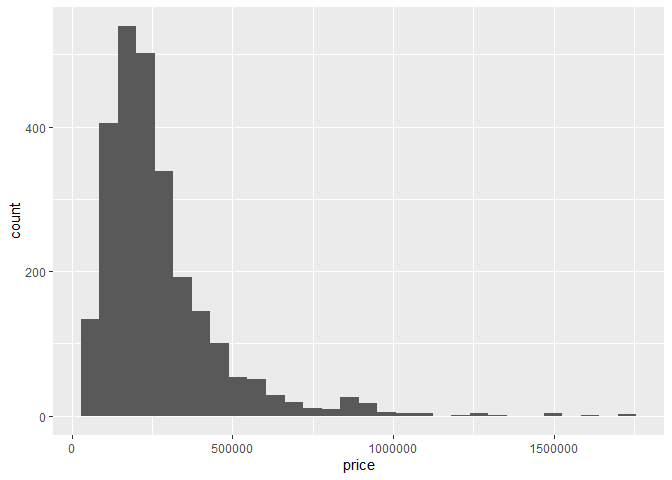
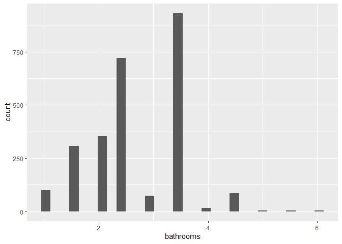
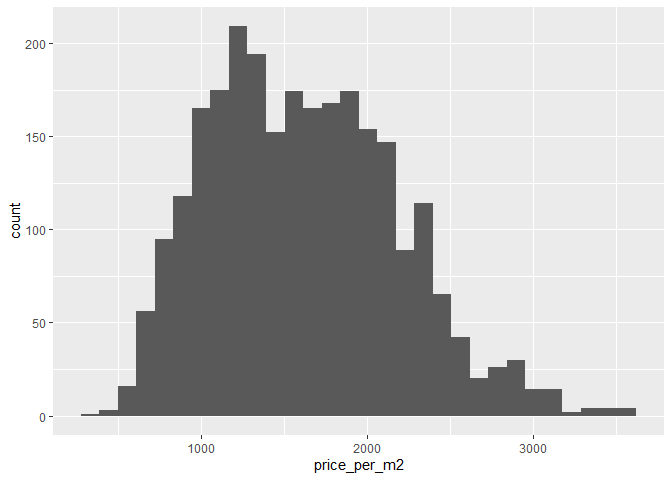
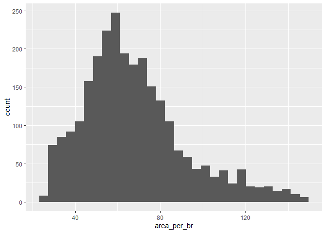
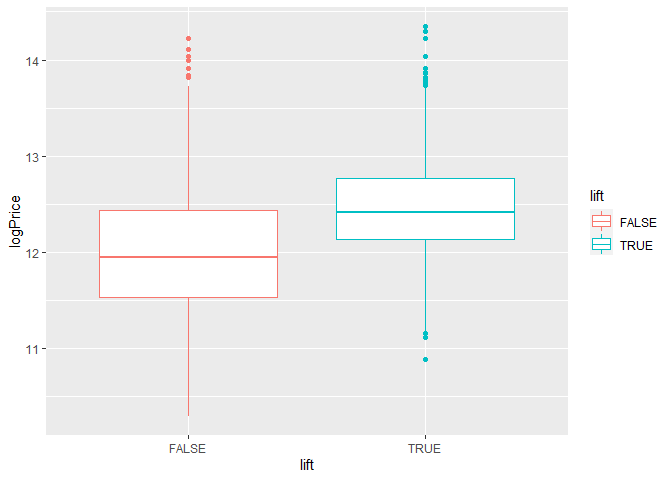

## Introduction

For this analysis, we will examine the effect that area (measured in squared meters) has on the value of apartment, for residential use, in Santo Domingo, Domincan Republic. Prices and apartment's characteristics are collect via web scraping. Specifically, data were retrieved on 2nd of August, 2022, from supercasas.com, a beacon on the online dominican real estate market.

## Loading the training dataset

Let's start by loading the libraries and the dataset to be used here. I already cleaned the data by detecting and removing outliers, and performed some initial feature engineering on it. Now, I have to a bit deeper analyzing each feature and how they relate to each other.


```r
rm(list = ls())

library(tidyverse)
```

```
## ── Attaching packages ─────────────────────────────────────── tidyverse 1.3.1 ──
```

```
## ✔ ggplot2 3.3.6     ✔ purrr   0.3.4
## ✔ tibble  3.1.7     ✔ dplyr   1.0.9
## ✔ tidyr   1.2.0     ✔ stringr 1.4.0
## ✔ readr   2.1.2     ✔ forcats 0.5.1
```

```
## ── Conflicts ────────────────────────────────────────── tidyverse_conflicts() ──
## ✖ dplyr::filter() masks stats::filter()
## ✖ dplyr::lag()    masks stats::lag()
```

```r
library(pastecs)
```

```
## 
## Attaching package: 'pastecs'
```

```
## The following objects are masked from 'package:dplyr':
## 
##     first, last
```

```
## The following object is masked from 'package:tidyr':
## 
##     extract
```

```r
library(GGally)
```

```
## Registered S3 method overwritten by 'GGally':
##   method from   
##   +.gg   ggplot2
```

```r
training <- read_csv("../../1_Data Cleaning/1_data/training_set.csv") %>%
  na.omit()
```

```
## Rows: 2897 Columns: 20
```

```
## ── Column specification ────────────────────────────────────────────────────────
## Delimiter: ","
## chr (4): id, seller, location, status
## dbl (7): parking, bathrooms, bedrooms, area, price, price_per_m2, area_per_br
## lgl (9): planta, lift, pool, pozo, terraza, lobby, balcon, jacuzzi, gimnasio
## 
## ℹ Use `spec()` to retrieve the full column specification for this data.
## ℹ Specify the column types or set `show_col_types = FALSE` to quiet this message.
```

```r
testing <- read_csv("../../1_Data Cleaning/1_data/testing_set.csv") %>%
  na.omit()
```

```
## Rows: 1375 Columns: 20
## ── Column specification ────────────────────────────────────────────────────────
## Delimiter: ","
## chr (4): id, seller, location, status
## dbl (7): parking, bathrooms, bedrooms, area, price, price_per_m2, area_per_br
## lgl (9): planta, lift, pool, pozo, terraza, lobby, balcon, jacuzzi, gimnasio
## 
## ℹ Use `spec()` to retrieve the full column specification for this data.
## ℹ Specify the column types or set `show_col_types = FALSE` to quiet this message.
```

## Reviewing the dataset

Let's start by review the dataset. It contains 20 features for 2,897 observations. Of these 20 features, only `area`, `price`, `parking`, `bedrooms`, `bathrooms`, `price_per_m2` and `area_per_br` are numerical. All others are categorical, such as `status` and `lift`.


```r
glimpse(training)
```

```
## Rows: 2,594
## Columns: 20
## $ id           <chr> "/apartamentos-venta-piantini/1286053/", "/apartamentos-v…
## $ parking      <dbl> 1, 4, 2, 2, 2, 2, 2, 2, 2, 2, 2, 2, 3, 2, 2, 3, 2, 1, 1, …
## $ bathrooms    <dbl> 2.0, 4.5, 2.0, 2.0, 3.5, 2.0, 3.5, 2.0, 2.5, 2.0, 3.5, 3.…
## $ bedrooms     <dbl> 1, 4, 3, 3, 3, 3, 3, 3, 2, 3, 3, 3, 3, 3, 2, 3, 2, 1, 1, …
## $ seller       <chr> "KW Capital", "Innova By Bello Jaquez", "Premium Real Est…
## $ location     <chr> "Piantini", "Piantini", "Piantini", "Piantini", "Piantini…
## $ status       <chr> "New", "Used", "Used", "Used", "Used", "Rebuilding", "New…
## $ area         <dbl> 76, 336, 180, 180, 230, 176, 190, 155, 123, 153, 290, 148…
## $ planta       <lgl> TRUE, TRUE, FALSE, FALSE, TRUE, FALSE, TRUE, TRUE, TRUE, …
## $ lift         <lgl> TRUE, TRUE, FALSE, FALSE, TRUE, FALSE, TRUE, FALSE, TRUE,…
## $ pool         <lgl> TRUE, FALSE, FALSE, FALSE, FALSE, FALSE, TRUE, FALSE, TRU…
## $ pozo         <lgl> TRUE, FALSE, FALSE, FALSE, FALSE, FALSE, FALSE, FALSE, FA…
## $ terraza      <lgl> TRUE, FALSE, FALSE, FALSE, FALSE, FALSE, TRUE, FALSE, FAL…
## $ lobby        <lgl> TRUE, TRUE, FALSE, FALSE, TRUE, FALSE, TRUE, TRUE, TRUE, …
## $ balcon       <lgl> TRUE, FALSE, FALSE, FALSE, FALSE, FALSE, TRUE, TRUE, TRUE…
## $ jacuzzi      <lgl> TRUE, FALSE, FALSE, FALSE, FALSE, FALSE, FALSE, FALSE, TR…
## $ gimnasio     <lgl> TRUE, FALSE, FALSE, FALSE, FALSE, FALSE, TRUE, FALSE, TRU…
## $ price        <dbl> 227000.0, 340000.0, 200000.0, 200000.0, 270000.0, 147008.…
## $ price_per_m2 <dbl> 2986.8421, 1011.9048, 1111.1111, 1111.1111, 1173.9130, 83…
## $ area_per_br  <dbl> 76.00000, 84.00000, 60.00000, 60.00000, 76.66667, 58.6666…
```

## Univariate analysis

So, let's calculate some descriptive statistics on these. For this, I used `pastec` library. it includes a nice function that calculates the number of observations, number of null values, mean, and some other statistics that can give me an idea on these features.


```r
myvars <- c("price", "area", "parking", "bedrooms", "bathrooms", "price_per_m2",
            "area_per_br")

pastecs::stat.desc(training[myvars], norm = TRUE)
```

```
##                     price         area      parking      bedrooms     bathrooms
## nbr.val      2.594000e+03 2.594000e+03 2.594000e+03  2.594000e+03  2.594000e+03
## nbr.null     0.000000e+00 0.000000e+00 0.000000e+00  0.000000e+00  0.000000e+00
## nbr.na       0.000000e+00 0.000000e+00 0.000000e+00  0.000000e+00  0.000000e+00
## min          2.957265e+04 3.500000e+01 1.000000e+00  1.000000e+00  1.000000e+00
## max          1.700000e+06 7.200000e+02 6.000000e+00  5.000000e+00  6.000000e+00
## range        1.670427e+06 6.850000e+02 5.000000e+00  4.000000e+00  5.000000e+00
## sum          7.040213e+08 4.487170e+05 5.179000e+03  6.521000e+03  7.047500e+03
## median       2.279985e+05 1.500000e+02 2.000000e+00  3.000000e+00  2.500000e+00
## mean         2.714037e+05 1.729827e+02 1.996530e+00  2.513878e+00  2.716847e+00
## SE.mean      3.616826e+03 1.894084e+00 1.515562e-02  1.575695e-02  1.693380e-02
## CI.mean.0.95 7.092158e+03 3.714069e+00 2.971833e-02  3.089747e-02  3.320514e-02
## var          3.393322e+10 9.306112e+03 5.958229e-01  6.440418e-01  7.438387e-01
## std.dev      1.842097e+05 9.646819e+01 7.718957e-01  8.025221e-01  8.624609e-01
## coef.var     6.787296e-01 5.576755e-01 3.866185e-01  3.192367e-01  3.174492e-01
## skewness     2.514024e+00 1.281258e+00 9.061759e-01 -6.202122e-01  2.669914e-02
## skew.2SE     2.615169e+01 1.332806e+01 9.426334e+00 -6.451647e+00  2.777331e-01
## kurtosis     9.903645e+00 1.879650e+00 1.808312e+00 -2.551558e-01 -4.264139e-01
## kurt.2SE     5.153025e+01 9.780120e+00 9.408938e+00 -1.327616e+00 -2.218700e+00
## normtest.W   7.876065e-01 9.019626e-01 8.050215e-01  7.817354e-01  9.126321e-01
## normtest.p   7.064632e-50 6.546488e-38 1.807815e-48  2.488421e-50  2.843246e-36
##               price_per_m2  area_per_br
## nbr.val       2.594000e+03 2.594000e+03
## nbr.null      0.000000e+00 0.000000e+00
## nbr.na        0.000000e+00 0.000000e+00
## min           3.532764e+02 2.666667e+01
## max           3.588517e+03 1.490000e+02
## range         3.235240e+03 1.223333e+02
## sum           4.202280e+06 1.758297e+05
## median        1.582904e+03 6.400000e+01
## mean          1.620000e+03 6.778323e+01
## SE.mean       1.105049e+01 4.712967e-01
## CI.mean.0.95  2.166867e+01 9.241559e-01
## var           3.167619e+05 5.761808e+02
## std.dev       5.628160e+02 2.400377e+01
## coef.var      3.474173e-01 3.541254e-01
## skewness      4.562025e-01 8.934021e-01
## skew.2SE      4.745565e+00 9.293457e+00
## kurtosis     -1.512745e-01 6.789671e-01
## kurt.2SE     -7.871053e-01 3.532775e+00
## normtest.W    9.804542e-01 9.464208e-01
## normtest.p    2.031627e-18 9.640536e-30
```

The mean and median for `price`, `price_per_m2`, `area_per_br` and `area` look substantially different, and not so much for the other variables. This suggests that they might not follow a normal distribution as shown in the cleaning process. Let's plot the histogram for all numerical variables.


```r
g <- ggplot(training)
g + geom_histogram(aes(price))
```

```
## `stat_bin()` using `bins = 30`. Pick better value with `binwidth`.
```

<!-- -->

```r
g + geom_histogram(aes(area))
```

```
## `stat_bin()` using `bins = 30`. Pick better value with `binwidth`.
```

<!-- -->

```r
g + geom_histogram(aes(parking))
```

```
## `stat_bin()` using `bins = 30`. Pick better value with `binwidth`.
```

<!-- -->

```r
g + geom_histogram(aes(bedrooms))
```

```
## `stat_bin()` using `bins = 30`. Pick better value with `binwidth`.
```

<!-- -->

```r
g + geom_histogram(aes(bathrooms))
```

```
## `stat_bin()` using `bins = 30`. Pick better value with `binwidth`.
```

<!-- -->

```r
g + geom_histogram(aes(price_per_m2))
```

```
## `stat_bin()` using `bins = 30`. Pick better value with `binwidth`.
```

<!-- -->

```r
g + geom_histogram(aes(area_per_br))
```

```
## `stat_bin()` using `bins = 30`. Pick better value with `binwidth`.
```

<!-- -->

### Transforming `price` and `area`

So, `price` and `area` are right-skewed, and so are the calculated features `price_per_m2` and `area_per_br`. Hence, as `price` and `area` do not follow a normal distribution, it is necessary to transform them. The most common transformation is the logarithmic one, which i used here:


```r
training <- training %>%
  mutate(logPrice = log(price),
         logArea = log(area))

testing <- testing %>%
  mutate(logPrice = log(price),
         logArea = log(area))

ggplot(training, aes(logPrice)) + geom_histogram()
```

```
## `stat_bin()` using `bins = 30`. Pick better value with `binwidth`.
```

<!-- -->

```r
ggplot(training, aes(logArea)) + geom_histogram()
```

```
## `stat_bin()` using `bins = 30`. Pick better value with `binwidth`.
```

<!-- -->

From the previous plots, it is evident that `parking`, `bedrooms`, and `bathrooms` are categorical, despite initial impressions.

## Bivariate analysis

Let's start by looking at feature-pairwise plots:


```r
myvars <- append(myvars, c("logPrice", "logArea"))
ggpairs(training[myvars])
```

<!-- -->

Some observations from the previous plot:

-   `price` and `area` are highly correlated, as expected.

-   `price` is also highly correlated with `parking` and `area_per_ber`.

-   `price_per_m2` is not highly correlated with other variables, except for `bedrooms`. The relationship is negative. This suggests that `price_per_m2` is sort of fixed for this location and correlates with the number of bedrooms (not considering categorical variables yet). This makes sense. Would you pay the same for an apartment with 90 squared meters with two bedrooms as with another with three bedrooms in the same area? Probably not, because it would mean less room (lol) for other spaces (such as kitchen, living room, etc.)

Now, let's zoom in at the plot of area against price:


```r
ggplot(training, aes( y = logPrice, x = logArea)) +
  geom_point() +
  geom_smooth()
```

```
## `geom_smooth()` using method = 'gam' and formula 'y ~ s(x, bs = "cs")'
```

<!-- -->

```r
ggplot(training, aes( y = logPrice, x = area)) +
  geom_point() +
  geom_smooth()
```

```
## `geom_smooth()` using method = 'gam' and formula 'y ~ s(x, bs = "cs")'
```

<!-- -->

The relationship is positive, as expected. But, it seems as if the variance changes as area increases. That is, my certainty about the asking price for any apartment decreases as the area increases. This is preliminary as I am not yet controlling for other variables.

Viewing how prices changes as the amount of parking spots increases


```r
summary(as.factor(training$parking))
```

```
##    1    2    3    4    5    6 
##  624 1486  371   99   10    4
```

```r
ggplot(training, aes(x = factor(parking), y = logPrice, colour = factor(parking))) +
  geom_boxplot()
```

<!-- -->

Now, I use Kabacoff's function (sourced from his personal site) to compare differences in price by the number of parking spots. This function uses the Wilcoxon signed rank test while controlling for Type I errors (using the method developed by Holm). Find out more on this at his website or in his book: R in Action, section 7.5.


```r
source("http://www.statmethods.net/RiA/wmc.txt")
wmc(logPrice ~ parking, data = training, method = "holm")
```

```
## Warning in xtfrm.data.frame(x): cannot xtfrm data frames
```

```
## Descriptive Statistics
## 
##                  1            2           3          4          5        6
## n      624.0000000 1486.0000000 371.0000000 99.0000000 10.0000000  4.00000
## median  11.8093763   12.3673408  12.9831013 13.4444469 13.5341220 14.03865
## mad      0.3471914    0.3371282   0.3477768  0.4336971  0.1880444  0.00000
## 
## Multiple Comparisons (Wilcoxon Rank Sum Tests)
## Probability Adjustment = holm
## 
##    Group.1 Group.2        W             p    
## 1        1       2 121734.5 1.082716e-156 ***
## 2        1       3   1268.5 3.253104e-149 ***
## 3        1       4    435.5  5.665199e-55 ***
## 4        1       5      0.0  5.106001e-07 ***
## 5        1       6      0.0  3.267003e-03  **
## 6        2       3  67820.0 5.949405e-111 ***
## 7        2       4   9187.0  3.158452e-47 ***
## 8        2       5     58.5  5.106001e-07 ***
## 9        2       6      0.0  3.267003e-03  **
## 10       3       4   9668.5  4.398785e-12 ***
## 11       3       5    405.0  1.723871e-04 ***
## 12       3       6      1.5  3.267003e-03  **
## 13       4       5    441.0  5.741904e-01    
## 14       4       6     18.5  6.699616e-03  **
## 15       5       6      0.0  1.121405e-02   *
## ---
## Signif. codes:  0 '***' 0.001 '**' 0.01 '*' 0.05 '.' 0.1 ' ' 1
```

This confirms what can be seem on the plot: price stop increasing from 4 parking spots onwards. But the sample size for this subset (5 and 6 parking spots per apartment) is too small to draw confident conclusions.

Repeating the same procedure with `bedrooms`, I got that price increases with increases in the number of bedrooms. But this relationship stops on 5-bedrooms apartments. Then again, sample size is too small to draw conclusions:


```r
summary(as.factor(training$bedrooms))
```

```
##    1    2    3    4    5 
##  392  588 1511   95    8
```

```r
ggplot(training, aes(factor(bedrooms), logPrice, colour = factor(bedrooms))) +
  geom_boxplot()
```

<!-- -->

```r
wmc(logPrice ~ bedrooms, data = training, method = "holm")
```

```
## Warning in xtfrm.data.frame(x): cannot xtfrm data frames
```

```
## Descriptive Statistics
## 
##                  1           2            3          5          4
## n      392.0000000 588.0000000 1511.0000000  8.0000000 95.0000000
## median  11.9159205  12.2307653   12.4874851 12.9232427 13.3046849
## mad      0.2396005   0.3117459    0.5147531  0.3521608  0.6011426
## 
## Multiple Comparisons (Wilcoxon Rank Sum Tests)
## Probability Adjustment = holm
## 
##    Group.1 Group.2        W            p    
## 1        1       2  55479.5 2.739855e-42 ***
## 2        1       3 104682.0 7.800043e-86 ***
## 3        1       5     94.0 2.125648e-05 ***
## 4        1       4    200.5 1.074840e-49 ***
## 5        2       3 280426.0 1.208721e-38 ***
## 6        2       5    740.0 2.592811e-03  **
## 7        2       4   2715.0 1.952901e-44 ***
## 8        3       5   3671.5 1.104791e-01    
## 9        3       4  23584.0 2.109641e-27 ***
## 10       5       4    234.0 1.104791e-01    
## ---
## Signif. codes:  0 '***' 0.001 '**' 0.01 '*' 0.05 '.' 0.1 ' ' 1
```

Now with `bathroom` it still a positive relationship with `logPrice` but not as simple as previously. Again, sample size is rather small as to draw meaningful conclusions for 4-bathrooms onwards apartments. As for apartments with one to two bathrooms, there's no obvious difference. Otherwise, the relationship is clear.


```r
summary(as.factor(training$bathrooms))
```

```
##   1 1.5   2 2.5   3 3.5   4 4.5   5 5.5   6 
##  99 308 352 720  73 930  15  85   4   4   4
```

```r
ggplot(training, aes(factor(bathrooms), logPrice, colour = factor(bathrooms))) +
  geom_boxplot()
```

<!-- -->

```r
wmc(logPrice ~ bathrooms, data = training, method = "holm")
```

```
## Warning in xtfrm.data.frame(x): cannot xtfrm data frames
```

```
## Descriptive Statistics
## 
##                  2          1         1.5         2.5          3         3.5
## n      352.0000000 99.0000000 308.0000000 720.0000000 73.0000000 930.0000000
## median  11.6308092 11.7675677  11.9175899  12.2596987 12.4490188  12.7068479
## mad      0.5585451  0.3324857   0.2474702   0.2518028  0.4519285   0.3924332
##                 4          6          5        4.5         5.5
## n      15.0000000  4.0000000  4.0000000 85.0000000  4.00000000
## median 12.9598444 13.0646580 13.2381922 13.3046849 13.31040212
## mad     0.6316167  0.4631849  0.4727601  0.5762243  0.06553904
## 
## Multiple Comparisons (Wilcoxon Rank Sum Tests)
## Probability Adjustment = holm
## 
##    Group.1 Group.2       W             p    
## 1        2       1 15935.0  1.000000e+00    
## 2        2     1.5 36447.0  1.424150e-11 ***
## 3        2     2.5 40838.5  4.821028e-71 ***
## 4        2       3  2863.5  6.198454e-24 ***
## 5        2     3.5 10594.5 6.702678e-146 ***
## 6        2       4   176.5  3.437416e-08 ***
## 7        2       6    12.0  1.820218e-02   *
## 8        2       5     2.0  1.820218e-02   *
## 9        2     4.5   179.5  1.002716e-43 ***
## 10       2     5.5     0.0  1.820218e-02   *
## 11       1     1.5 10503.0  1.054027e-04 ***
## 12       1     2.5  8706.0  1.356986e-32 ***
## 13       1       3   640.0  1.358060e-18 ***
## 14       1     3.5  1257.0  1.987939e-55 ***
## 15       1       4    26.5  7.185462e-08 ***
## 16       1       6     1.0  1.820218e-02   *
## 17       1       5     0.0  1.820218e-02   *
## 18       1     4.5    13.0  1.100184e-29 ***
## 19       1     5.5     0.0  1.820218e-02   *
## 20     1.5     2.5 40223.0  2.433536e-57 ***
## 21     1.5       3  2933.0  3.924768e-21 ***
## 22     1.5     3.5  5520.5 1.011322e-139 ***
## 23     1.5       4   133.5  2.739393e-08 ***
## 24     1.5       6     1.0  1.820218e-02   *
## 25     1.5       5     0.0  1.820218e-02   *
## 26     1.5     4.5    70.0  3.982977e-43 ***
## 27     1.5     5.5     0.0  1.820218e-02   *
## 28     2.5       3 18092.0  3.616929e-04 ***
## 29     2.5     3.5 99775.0 1.071619e-130 ***
## 30     2.5       4  1459.0  4.372992e-05 ***
## 31     2.5       6   151.0  3.814392e-02   *
## 32     2.5       5    47.5  1.820218e-02   *
## 33     2.5     4.5  2117.0  3.753033e-43 ***
## 34     2.5     5.5    13.0  1.820218e-02   *
## 35       3     3.5 21849.5  1.354846e-05 ***
## 36       3       4   262.5  3.183920e-02   *
## 37       3       6    48.0  3.779310e-01    
## 38       3       5    27.0  1.108265e-01    
## 39       3     4.5   698.5  2.063309e-15 ***
## 40       3     5.5    20.0  7.131918e-02   .
## 41     3.5       4  5191.0  1.000000e+00    
## 42     3.5       6  1070.5  1.000000e+00    
## 43     3.5       5   697.5  4.324760e-01    
## 44     3.5     4.5 15964.0  3.455446e-18 ***
## 45     3.5     5.5   541.0  2.290919e-01    
## 46       4       6    26.0  1.000000e+00    
## 47       4       5    21.0  1.000000e+00    
## 48       4     4.5   446.5  8.563397e-01    
## 49       4     5.5    20.5  1.000000e+00    
## 50       6       5     6.0  1.000000e+00    
## 51       6     4.5   133.0  1.000000e+00    
## 52       6     5.5     6.0  1.000000e+00    
## 53       5     4.5   162.0  1.000000e+00    
## 54       5     5.5     8.0  1.000000e+00    
## 55     4.5     5.5   185.0  1.000000e+00    
## ---
## Signif. codes:  0 '***' 0.001 '**' 0.01 '*' 0.05 '.' 0.1 ' ' 1
```

One way to make sense of the previous three features is to create a new one that captures how area per rooms relate to price. I got no information regarding how many living rooms (or other rooms such as family rooms and the likes), so I will work with the available information. The purpose is to create a proxy of living spaces: an apartment with 90 squared meters and three bedrooms, two parking spots, and three and a half bathrooms should be less expensive than another apartment with the same area but have two bedrooms and two and a half bathrooms (and still two parking spots). Because it would mean that each room is bigger:


```r
training <- training %>%
  mutate(area_per_room = area / (bedrooms + bathrooms + parking))

testing <- testing %>%
  mutate(area_per_room = area / (bedrooms + bathrooms + parking))

ggplot(training, aes(y = logPrice, x = area / (bedrooms + bathrooms + parking))) + geom_point()
```

<!-- -->

I'll repeat the same process with `status`. This feature tells me whether an apartment is in construction, newly constructed or used.


```r
training$status <- as.factor(training$status)

testing$status <- as.factor(testing$status)

summary(training$status)
```

```
##     Building In blueprint          New   Rebuilding      Rebuilt         Used 
##          787          151          760            2           26          868
```

```r
ggplot(training, aes(x = status, y = logPrice, colour = status)) + geom_boxplot()
```

<!-- -->


```r
wmc(logPrice ~ status, data = training, method = "holm")
```

```
## Warning in xtfrm.data.frame(x): cannot xtfrm data frames
```

```
## Descriptive Statistics
## 
##        In blueprint    Building Rebuilding       New  Rebuilt        Used
## n        151.000000 787.0000000  2.0000000 760.00000 26.00000 868.0000000
## median    11.901583  12.1807548 12.2409493  12.38839 12.42922  12.4684369
## mad        0.490074   0.5129069  0.5080919   0.51383  0.73114   0.4650287
## 
## Multiple Comparisons (Wilcoxon Rank Sum Tests)
## Probability Adjustment = holm
## 
##         Group.1    Group.2        W            p    
## 1  In blueprint   Building  38329.0 5.584103e-11 ***
## 2  In blueprint Rebuilding     84.0 1.000000e+00    
## 3  In blueprint        New  26937.0 8.408610e-24 ***
## 4  In blueprint    Rebuilt    937.5 2.161253e-04 ***
## 5  In blueprint       Used  24243.5 5.613591e-34 ***
## 6      Building Rebuilding    725.0 1.000000e+00    
## 7      Building        New 240678.5 3.304011e-10 ***
## 8      Building    Rebuilt   8056.0 5.194588e-01    
## 9      Building       Used 236998.0 6.730847e-26 ***
## 10   Rebuilding        New    636.0 1.000000e+00    
## 11   Rebuilding    Rebuilt     22.0 1.000000e+00    
## 12   Rebuilding       Used    629.0 1.000000e+00    
## 13          New    Rebuilt   9340.0 1.000000e+00    
## 14          New       Used 292774.5 8.071949e-04 ***
## 15      Rebuilt       Used  10883.0 1.000000e+00    
## ---
## Signif. codes:  0 '***' 0.001 '**' 0.01 '*' 0.05 '.' 0.1 ' ' 1
```

`rebuilding` and `rebuit` don't have enough data to state significant differences among categories. All other categories show significant differences with each other.


```r
training <- training %>%
  mutate(status = ifelse(status == "In blueprint", "Building", as.character(status)),
         status = ifelse(status == "Rebuilding", "Used", as.character(status)),
         status = ifelse(status == "Rebuilt", "Used", as.character(status)),
         status = factor(status, levels = c("Building", "New", "Used")))

testing <- testing %>%
  mutate(status = ifelse(status == "In blueprint", "Building", as.character(status)),
         status = ifelse(status == "Rebuilding", "Used", as.character(status)),
         status = ifelse(status == "Rebuilt", "Used", as.character(status)),
         status = factor(status, levels = c("Building", "New", "Used")))

ggplot(training, aes(x = status, y = logPrice, colour = status)) + geom_boxplot()
```

<!-- -->

When testing whether there is significant differences in `price` among apartments with a `gym` versus those that don't, I can conclude that it exists. In this case, I use the Wilcoxon test as the distribution of `price` is right skewed.


```r
prop.table(table(training$gimnasio))
```

```
## 
##     FALSE      TRUE 
## 0.4545104 0.5454896
```

```r
ggplot(training, aes(gimnasio, logPrice, colour = as.factor(gimnasio))) +
  geom_boxplot()
```

<!-- -->

```r
wilcox.test(logPrice ~ gimnasio, data = training)
```

```
## 
## 	Wilcoxon rank sum test with continuity correction
## 
## data:  logPrice by gimnasio
## W = 639059, p-value < 2.2e-16
## alternative hypothesis: true location shift is not equal to 0
```

Now on `planta`, that is whether the condo where the apartment is located has its own power plant:


```r
prop.table(table(training$planta))
```

```
## 
##    FALSE     TRUE 
## 0.349653 0.650347
```

```r
ggplot(training, aes(y = logPrice, x = planta, colour = planta)) + geom_boxplot()
```

<!-- -->

```r
wilcox.test(logPrice ~ planta, data = training)
```

```
## 
## 	Wilcoxon rank sum test with continuity correction
## 
## data:  logPrice by planta
## W = 527489, p-value < 2.2e-16
## alternative hypothesis: true location shift is not equal to 0
```

On lift:


```r
prop.table(table(training$lift))
```

```
## 
##     FALSE      TRUE 
## 0.2729375 0.7270625
```

```r
ggplot(training, aes(y = logPrice, x = lift, colour = lift)) + geom_boxplot()
```

<!-- -->

```r
wilcox.test(logPrice ~ lift, data = training)
```

```
## 
## 	Wilcoxon rank sum test with continuity correction
## 
## data:  logPrice by lift
## W = 378633, p-value < 2.2e-16
## alternative hypothesis: true location shift is not equal to 0
```

About `location`, I am pretty sure that it provides valuable information to make inference and predictions on apartments' price. Nevertheless, there are 144 different locations. It would be cumbersome to create that many dummy variables. For the time being, we will focus on the locations specified by the constructing company.


```r
length(unique(training$location))
```

```
## [1] 137
```

## Conclusions

-   `price`, as it doesn't follow a normal distribution, was log-transformed. By doing this, it might satisfy all the assumptions of the linear regression model.

-   As expected, `area` and `price` are highly correlated.

-   At first glance, the assumption of homoscedasticity does not seem to hold. This will be tested on the modelling stage.

-   Without controlling for other variables, the presence of lifts, gyms and other amenities are positively correlated with price. This might change when controlling for other variables, especially status, as I would expect for newer apartments to have more amenities.

-   There doesn't seem to be an association between `price_per_m2` and other numerical variables, except for the number of bedrooms. It is negatively correlated with the latter.

-   There are too many unique locations, as to model each one individually (through dummy variables). I'll focus on the locations of interest. In the future, it will be interesting to group locations by some common characteristic (such as income level or socioeconomic status) using external data or by modelling using K-means algorithm.


```r
write_csv(training, "../../2_Exploratory Data Analysis/1_data/training_set.csv")
write_csv(testing, "../../2_Exploratory Data Analysis/1_data/testing_set.csv")
```
