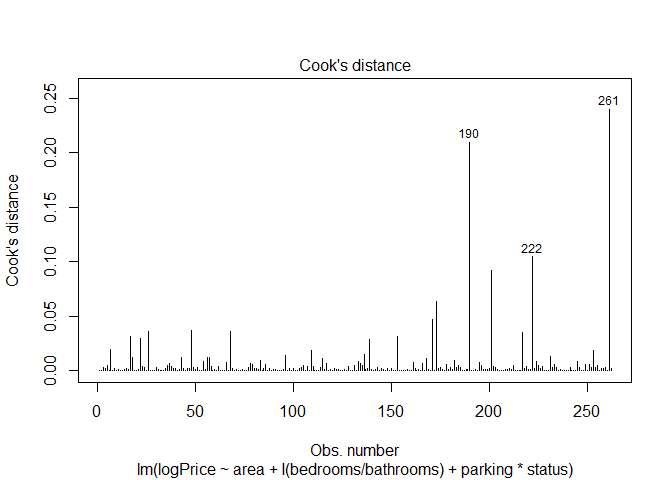

# Modelling Bella Vista, Santo Domingo

## Introduction

For this analysis, we will examine the effect that area (measured in squared meters) has on the value of apartment, for residential use, in Bella Vista, a neighborhood in Santo Domingo, Domincan Republic. Prices and apartment's characteristics are collect via web scraping. Specifically, data were retrieved on 2nd of August, 2022, from supercasas.com, a beacon on the online dominican real estate market.

First, I load the libraries and datasets to be used.


```r
rm(list = ls())

library(tidyverse)
```

```
## ── Attaching packages ─────────────────────────────────────── tidyverse 1.3.1 ──
```

```
## ✔ ggplot2 3.3.6     ✔ purrr   0.3.4
## ✔ tibble  3.1.7     ✔ dplyr   1.0.9
## ✔ tidyr   1.2.0     ✔ stringr 1.4.0
## ✔ readr   2.1.2     ✔ forcats 0.5.1
```

```
## ── Conflicts ────────────────────────────────────────── tidyverse_conflicts() ──
## ✖ dplyr::filter() masks stats::filter()
## ✖ dplyr::lag()    masks stats::lag()
```

```r
training <- read_csv("../../2_Exploratory Data Analysis/1_data/training_set.csv") %>%
  filter(location %in% c("Bella Vista", "Bella Vista Norte",
                         "Bella Vista Sur")) %>%
  mutate(status = factor(status, levels = c("Building", "New", "Used")),
         location = case_when(location == "Bella Vista Norte" ~ "Bella Vista",
                              location == "Bella Vista Sur" ~ "Bella Vista",
                              TRUE ~ location)) %>%
  na.omit()
```

```
## Rows: 2897 Columns: 24
```

```
## ── Column specification ────────────────────────────────────────────────────────
## Delimiter: ","
## chr  (4): id, seller, location, status
## dbl (11): parking, bathrooms, bedrooms, area, price, price_per_m2, area_per_...
## lgl  (9): planta, lift, pool, pozo, terraza, lobby, balcon, jacuzzi, gimnasio
## 
## ℹ Use `spec()` to retrieve the full column specification for this data.
## ℹ Specify the column types or set `show_col_types = FALSE` to quiet this message.
```

```r
testing <- read_csv("../../2_Exploratory Data Analysis/1_data/testing_set.csv") %>%
  filter(location %in% c("Bella Vista", "Bella Vista Norte",
                         "Bella Vista Sur")) %>%
  mutate(status = factor(status, levels = c("In blueprint", "Building", "New",
                                            "Rebuilding", "Rebuilt", "Used")),
         location = case_when(location == "Bella Vista Norte" ~ "Bella Vista",
                              location == "Bella Vista Sur" ~ "Bella Vista",
                              TRUE ~ location)) %>%
  na.omit()
```

```
## Rows: 1375 Columns: 24
## ── Column specification ────────────────────────────────────────────────────────
## Delimiter: ","
## chr  (4): id, seller, location, status
## dbl (11): parking, bathrooms, bedrooms, area, price, price_per_m2, area_per_...
## lgl  (9): planta, lift, pool, pozo, terraza, lobby, balcon, jacuzzi, gimnasio
## 
## ℹ Use `spec()` to retrieve the full column specification for this data.
## ℹ Specify the column types or set `show_col_types = FALSE` to quiet this message.
```

## Model


```r
model <- lm(logPrice ~ area + I(bedrooms / bathrooms) + parking * status,
            data = training)
summary(model)
```

```
## 
## Call:
## lm(formula = logPrice ~ area + I(bedrooms/bathrooms) + parking * 
##     status, data = training)
## 
## Residuals:
##      Min       1Q   Median       3Q      Max 
## -0.49745 -0.12257 -0.00428  0.11314  0.63475 
## 
## Coefficients:
##                        Estimate Std. Error t value Pr(>|t|)    
## (Intercept)           11.281869   0.081405 138.589  < 2e-16 ***
## area                   0.003328   0.000223  14.925  < 2e-16 ***
## I(bedrooms/bathrooms)  0.132263   0.086633   1.527   0.1281    
## parking                0.294405   0.033680   8.741 3.20e-16 ***
## statusNew              0.591394   0.120185   4.921 1.55e-06 ***
## statusUsed             0.220317   0.094155   2.340   0.0201 *  
## parking:statusNew     -0.303080   0.053210  -5.696 3.38e-08 ***
## parking:statusUsed    -0.228000   0.040462  -5.635 4.64e-08 ***
## ---
## Signif. codes:  0 '***' 0.001 '**' 0.01 '*' 0.05 '.' 0.1 ' ' 1
## 
## Residual standard error: 0.2005 on 254 degrees of freedom
## Multiple R-squared:  0.7858,	Adjusted R-squared:  0.7799 
## F-statistic: 133.1 on 7 and 254 DF,  p-value: < 2.2e-16
```

## Regression diagnostics

Let's run some diagnostics now! The library `gvlma` got some useful diagnostic tool. With it, I can quickly check for heteroscedasticity, kurtosis and skewness. The last two can tell me whether the errors are normally distributed.


```r
gvlma::gvlma(model)
```

```
## 
## Call:
## lm(formula = logPrice ~ area + I(bedrooms/bathrooms) + parking * 
##     status, data = training)
## 
## Coefficients:
##           (Intercept)                   area  I(bedrooms/bathrooms)  
##             11.281869               0.003328               0.132263  
##               parking              statusNew             statusUsed  
##              0.294405               0.591394               0.220317  
##     parking:statusNew     parking:statusUsed  
##             -0.303080              -0.228000  
## 
## 
## ASSESSMENT OF THE LINEAR MODEL ASSUMPTIONS
## USING THE GLOBAL TEST ON 4 DEGREES-OF-FREEDOM:
## Level of Significance =  0.05 
## 
## Call:
##  gvlma::gvlma(x = model) 
## 
##                     Value p-value                Decision
## Global Stat        4.7290  0.3162 Assumptions acceptable.
## Skewness           0.9344  0.3337 Assumptions acceptable.
## Kurtosis           1.1530  0.2829 Assumptions acceptable.
## Link Function      1.4947  0.2215 Assumptions acceptable.
## Heteroscedasticity 1.1469  0.2842 Assumptions acceptable.
```

Homoscedasticity checked. Normality also seems to be checked, but just to be sure let's test it using `shapiro.test` for normality:


```r
shapiro.test(residuals(model))
```

```
## 
## 	Shapiro-Wilk normality test
## 
## data:  residuals(model)
## W = 0.99327, p-value = 0.2873
```

I got a p-value of 0.86. Hence, I cannot reject the null hypothesis. Thus, there is evidence that the errors are normally.

`gvlma` does not test for autocorrelation in the errors. So, I got to run other test. Here comes Durbin-Watson:


```r
car::durbinWatsonTest(model)
```

```
##  lag Autocorrelation D-W Statistic p-value
##    1     0.004309444      1.988121   0.872
##  Alternative hypothesis: rho != 0
```

The alternative hypothesis is there's presence of autocorrelation with one lag (meaning, compared with the previous observation). Since I cannot reject the null hypothesis, I concluded that there's evidence of autocorrelation.This makes sense as our data did not provided information on when any listing was published. And since not every listing was published at the same time, we could expect that previously published apartments informs the newly ones. Think of it like this: you got an apartment that you bought a long time ago and want to sell it now, but don't know how much to ask for it; what do you do? Research market prices. There are many ways in which new prices are informed by the old ones, but this can give you a sense of how autocorrelation is working in this scenario.

Autocorrelation severely limit our prediction power as we cannot predict future prices because we are not modelling as a time series regression. Nevertheless, this model could help us make inferences on the factor that contribute to price setting as of now.


```r
car::vif(model)
```

```
## there are higher-order terms (interactions) in this model
## consider setting type = 'predictor'; see ?vif
```

```
##                             GVIF Df GVIF^(1/(2*Df))
## area                    2.538484  1        1.593262
## I(bedrooms/bathrooms)   1.081666  1        1.040032
## parking                 3.663612  1        1.914056
## status                174.118962  2        3.632549
## parking:status        199.382651  2        3.757698
```


```r
cutoff <- 4 / (nrow(training) - length(model$coefficients) - 2)
plot(model, which = 4, cook.levels = cutoff)
```

<!-- -->

These observations are not outliers and cannot be removed:

1.  Observation 190 and 222 are luxury apartments.

2.  Observation 261 is an apartment with an predicted value higher than the actual value. In this case, it is an apartment older than the usual apartment in the zone with the same characteristics. This conclusion was reached after visual inspection. This rises the concern that this model does not differentiate on age on the used `status`. This gives the same predicted value for an old apartment than for a really old apartment (all with the same characteristics).

## Model evaluation


```r
RMSE <- function(observed, predicted) {
  e <- (observed - predicted) ^ 2
  RMSE <- sqrt(mean(e))
  
  return(RMSE)
}
RMSE_training <- RMSE(training$price, exp(fitted(model)))
RMSE_testing <- RMSE(testing$price, exp(predict(model, testing)))

data.frame(RMSE = c(RMSE_training, RMSE_testing),
           row.names = c("Testing", "Training"))
```

```
##              RMSE
## Testing  85696.71
## Training 82380.26
```

## Limitations and ways to improve

-   As apartments are not all listed at the same time, at any given moment, supercasas.com shows newly listed apartments along with not so newly listed one. Given that supercasas.com does not provide information regarding when each listing was published, I couldn't model price a time series. This violates the OLS' assumption of independence. Hence, this model is not suitable for predictions and should be limited for inferential analysis.

-   Nevertheless, a way to solve the previous observation is to programmatically retrieve apartments' price and it characteristics, assigning a date to the newly added listings. This way, it is possible when any listing (up to a date) was published and when was unpublished (this could be a proxy for when it was sold).

-   This model does not include information on location or neighborhood. Limiting the analysis on one location: Bella Vista. I need to find a way to group location on similar characteristics (be it income level , proximity or socioeconomic status).

-   `status` does not discriminates between recently used apartment and those that has been around for a long time. Hence, predictions on them won't be as accurate as in other categories.
